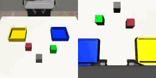
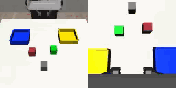
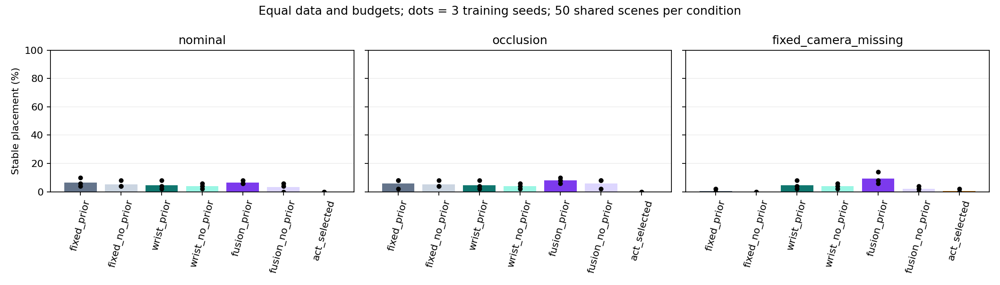
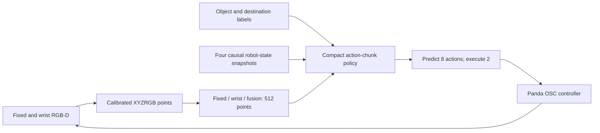

# GeoPolicy-Bench

**A controlled study of RGB-D camera fusion for Panda manipulation.**

[](https://github.com/Alecbossard/GeoPolicy-Bench/actions/workflows/checks.yml) · [MIT](LICENSE) · Windows / Python 3.11

Does a calibrated fixed + wrist camera policy place the requested cube more reliably than either view alone? How much of the result comes from an engineered color prior?

This project implements compact point-cloud diffusion and RGB ACT-style policies, diagnoses manipulation failures, and evaluates **21 models across three training seeds**. The emphasis is reproducible robot-learning experiments and honest comparisons.

[Results](#measured-results) · [Run the demo](#run-the-demo) · [Technical report](docs/v2_report.md) · [Architecture](docs/architecture.md) · [Raw data](results/v2/raw/main_rollouts.csv)

## Demo: a success and a failure

<table>
<tr><th>Correct placement</th><th>Wrong cube selected</th></tr>
<tr>
<td></td>
<td></td>
</tr>
<tr><td>Red cube → blue tray; stable for one second.</td><td>Green cube → blue tray; the requested red cube stays on the table.</td></tr>
</table>

Actual V2 checkpoint, fusion with prior, seed 0. These are the earliest success and failure in its nominal test, chosen by a disclosed rule. They illustrate behavior; the aggregate results below measure reliability. [Success MP4](results/v2/demo/success/nominal_300012_stable.mp4) · [Failure MP4](results/v2/demo/failure/nominal_300000_failure.mp4)

## Measured results

**The V2 work improved verification and reproduction, but did not demonstrate a nominal manipulation gain over V1.** On the same new scenes and stable-placement criterion, preserved V1 fusion achieved **16/150**, compared with **10/150** for V2. The targeted ACT search did not produce a reliable learned baseline.

| V2 policy | Nominal | Fixed camera occluded | Fixed camera absent |
| --- | ---: | ---: | ---: |
| Fixed RGB-D + prior | 10/150 | 9/150 | 1/150 |
| Wrist RGB-D + prior | 7/150 | 7/150 | 7/150 |
| Fusion RGB-D + prior | 10/150 | 12/150 | 14/150 |
| Fusion RGB-D without prior | 5/150 | 9/150 | 3/150 |
| Compact RGB ACT-style | 0/150 | 0/150 | 1/150 |

Each cell uses three training seeds and 50 shared reserved scenes. Fixed-only and wrist-only prior ablations are also included in the [full report](docs/v2_report.md).

With the fixed camera absent, fusion versus fixed-only was **+8.7 percentage points**, descriptive 95% interval **[+2.7, +16.0]**. Fusion versus wrist-only was **+4.7 pp [−2.0, +12.0]**; that advantage remains uncertain. The nominal manual-prior effect was **+3.3 pp [−2.7, +9.3]**, also uncertain. These are paired descriptive intervals with three seeds, without multiplicity correction.



The final evaluation comprises **3,150 main rollouts**, **300 V1 re-evaluations**, and **360 instruction controls**. No selected policy completed all four instructions on any of the 30 scene–training-seed pairs. [Machine-readable summary](results/v2/summary.json) · [Before/after raw results](results/v2/raw/before_after_rollouts.csv)

## How it works



Point policies share 200 successful demonstration prefixes, recorded post-release continuations, 21 validation episodes, frozen normalization, 7D actions, 8,000 updates and batch 32. View count and the manual chromatic attention prior vary; RGB and learned attention remain present in the prior ablation. ACT uses RGB and a different model capacity, so it is a compact comparison rather than architectural parity with the original paper.

Student inputs contain sensor observations, robot state and two one-hot instruction pairs. Object/goal truth is reserved for teacher generation and evaluation. Recipes were chosen on validation and frozen before the new test. [Information contracts](docs/contracts.md) · [V2 model cards](docs/v2_model_cards.md)

## Run the demo

Validated on **Windows, Python 3.11, RTX 4060 Laptop 8 GB**. The short replay needs the compact checkpoint bundle, but no training data or model-hub download. Start from the repository root, with [uv](https://docs.astral.sh/uv/) installed:

```powershell
uv venv --python 3.11 .venv
uv pip install --python .venv\Scripts\python.exe torch==2.7.1 torchvision==0.22.1 --index-url https://download.pytorch.org/whl/cu128
uv pip install --python .venv\Scripts\python.exe -r requirements-lock.txt
uv pip install --python .venv\Scripts\python.exe --no-deps -e .
.venv\Scripts\python scripts/download_demo.py
.venv\Scripts\python -m geopolicy.v2 demo
```

The downloader verifies the release bundle's SHA-256 before extracting it. If the preserved local bundle already exists, it uses that file. Replay writes videos, raw metrics, traces and exact-match checks to `artifacts/v2/demo_reproduced`.

For the existing local setup, only the last command is needed. [Full reproduction guide](docs/v2_reproduction.md) · [Bundle manifest](docs/releases/v2_demo.json) · [What is included](docs/PROJECT_GUIDE.md)

## Verification and limitations

The stable-placement score requires full cube containment, low linear/angular speed, open fingers and no finger contact for one continuous second while the policy keeps acting. Closing an empty hand can fail this conservative posture requirement even if the cube stays still. [Metric and design](docs/v2_design.md)

Executed checks include 20 CPU contract tests, real CUDA/dual-render resource gates, recorded/live input alignment, action normalization and gripper sign probes, exact continuation over 500 training updates, and an audit of **892,474 final trace steps**. A separate pinned environment and an isolated source-and-bundle copy reproduced every demo action and selected-object position exactly. These checks establish reproducibility on the tested setup, not general manipulation competence. [Verification evidence](results/v2/delivery_verification.json)

The task has two colored cubes, two trays and four known label combinations. No learned text encoder, pretrained vision, physical robot, open-vocabulary grounding or sim-to-real transfer was evaluated. Absolute success remains low. Original ACT/DP3 reproduction is not claimed. PPO and SmolVLA are secondary V1 experiments; their negative results remain available.

V1 and V2 results are separate. Historical V1 instantaneous rates use a different metric and test set; they must not be compared directly with the stable scores above. [V1 report](docs/final_report.md) · [V2 before/after report](docs/v2_report.md)

## Explore the repository

| Path | Contents |
| --- | --- |
| `src/geopolicy/` | Simulator, sensors, policies and V1/V2 experiment code |
| `configs/v2/` | Effective run configurations, normalization and frozen protocol |
| `tests/` | Geometry, input, action, stability and checkpoint contracts |
| `results/v2/` | Raw outcomes, comparisons, verification and videos |
| `docs/` | Reports, model/data cards, reproduction and technical decisions |
| `artifacts/` | Local weights, datasets and full traces; excluded from Git |

[Contributing and new experiments](CONTRIBUTING.md) · [Project guide](docs/PROJECT_GUIDE.md) · [MIT license](LICENSE) · [Third-party credits](docs/THIRD_PARTY_NOTICES.md)
