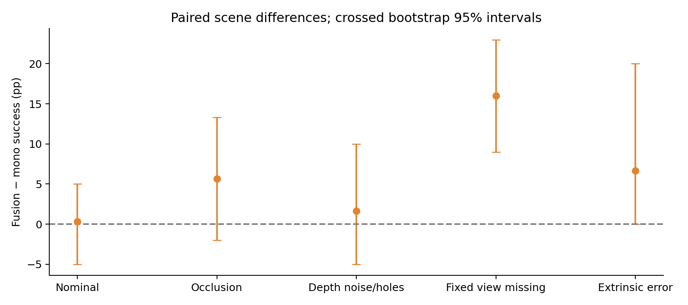

> V2 improvements are in progress. The measured figures below describe preserved V1. See [current progress](PROGRESS.md); V2 will be reported only after reserved testing and verification.

# GeoPolicy Bench

**Completed local benchmark.** Panda selection/placement with instruction-conditioned RGB-D policies. The experiment tests whether calibrated fixed+wrist fusion improves robustness over one fixed camera at equal demonstrations, architecture and optimization budget. The experimental core, closed-loop evaluations, resource gates and reproduction checks are complete; all artifacts remain local.

This repository contains a MuJoCo/robosuite task, a BC-initialized PPO teacher, lossless trajectory storage, compact ACT and DP3-inspired diffusion adaptations, and closed-loop evaluation. Nine principal models completed 8,000 updates each on three training seeds. Authentic SmolVLA passed an optimizer memory pilot and completed 500 fine-tuning updates; its exploratory behavior is reported separately. These are independent adaptations, with no exact paper reproduction, official LIBERO score or physical robot transfer claimed. Current execution status: [PROGRESS.md](PROGRESS.md).

The dataset contains 274 raw episodes, including failures. Every student uses the same 200 successful train episodes and 21 validation episodes. The teacher has genuine PPO updates after scripted BC initialization; task sequencing remains a privileged scripted curriculum. Final teacher controls give BC 82/100 and PPO 82/100: PPO learning is verified, with no demonstrated success gain.

## Measured results

| Condition | Mono success | Fusion success | Paired fusion minus mono, descriptive 95% interval |
| --- | --- | --- | --- |
| Nominal | 30.3% | 30.7% | +0.3 pp [−5.0, +5.0] |
| Fixed-view occlusion | 23.7% | 29.3% | +5.7 pp [−2.0, +13.3] |
| Fixed view missing | 1.0% | 17.0% | +16.0 pp [+9.0, +23.0] |

Rates are means over three training seeds, with 100 shared test scenes per seed and condition. Intervals resample both training seeds and paired scene columns. These runs support a camera-loss benefit within this scene family; nominal performance does not establish a fusion advantage. Absolute success remains low. Depth/extrinsic checks use 20 scenes per seed and are exploratory.

Compact ACT scores 0/20 nominal successes for each of three seeds. Fine-tuned SmolVLA scores 0/20; its conditional OOD budget is deferred under the frozen protocol. No learned mono/fusion model completes all four instruction changes on any counterfactual scene. These negative outcomes constrain the conclusions.

See the [measured final report](docs/final_report.md), [model cards](docs/model_cards.md), [principal raw CSV](results/raw/student_rollouts.csv) and [secondary summary](results/secondary_summary.json). The report includes seed-level metrics, uncertainty, failures, latency, resources, learning curves and provenance. [Success video](results/demos/success.mp4) and [failure video](results/demos/failure.mp4) replay actual test episodes with verified actions and terminal states.



Clean pinned-environment verification passed 13 CPU tests; the separate opt-in CUDA test passed. Replaying the last 500 updates of a trained diffusion model reproduced weights, EMA, optimizer, scheduler and RNG states exactly. The trained ONNX denoiser export preserves the surrounding PyTorch policy and passed numerical and paired closed-loop checks.

## Local installation

Validated target: Windows, Python 3.11, Ryzen 7 7435HS, 16 GB RAM and RTX 4060 Laptop 8 GB. Prerequisites: Git and uv. Install in an isolated environment from the repository root:

```powershell
uv venv --python 3.11 .venv
uv pip install --python .venv\Scripts\python.exe torch==2.7.1 torchvision==0.22.1 --index-url https://download.pytorch.org/whl/cu128
uv pip install --python .venv\Scripts\python.exe -r requirements-lock.txt
uv pip install --python .venv\Scripts\python.exe -e .
.venv\Scripts\python -m pytest -q
.venv\Scripts\python scripts\smoke_lift.py
```

The lock file excludes machine-specific editable paths. NumPy 1.26.4 is required by the chosen robosuite/Mink dependency chain. A clean `.venv-repro` installed these pins, passed local tests and reproduced a selected checkpoint rollout exactly. LeRobot uses a separate `.venv-vla` with NumPy 2; its metadata-only OSC wheel and compatibility proof are documented below. See [technical decisions](docs/technical_decisions.md), [contracts](docs/contracts.md) and [artifact/reproduction instructions](docs/artifact_publication.md). Drivers and system settings were not changed. Other platforms are not claimed tested.

## Commands

These commands document the executed recipe. Restoring the original local artifacts permits hash-verified replay. A fresh collection has new provenance, timings and file hashes: use a separate experiment checkout and freeze its own dataset manifest/protocol before evaluating it. Preserve the historical configs and results in this checkout.

```powershell
# Scripted diagnostic/bootstrap, never labeled PPO demonstrations
.venv\Scripts\python scripts\reference_pilot.py --episodes 64
# Actual BC-initialized on-policy PPO pilot and continuation
.venv\Scripts\python -m geopolicy.cli teacher-train --out artifacts/teacher_pilot --steps 2048
.venv\Scripts\python -m geopolicy.cli teacher-train --out artifacts/teacher_main --steps 32768 --resume artifacts/teacher_pilot/latest.zip
# Actual selected teacher was the 2048-step pilot, chosen on validation
Copy-Item artifacts/teacher_pilot/latest.zip artifacts/teacher_selected.zip
# Lossless collection with explicit checkpoint hash/provenance
.venv\Scripts\python -m geopolicy.cli collect --out artifacts/dataset --episodes 250 --first-seed 1000 --teacher artifacts/teacher_selected.zip
.venv\Scripts\python -m geopolicy.cli collect --out artifacts/dataset --episodes 24 --first-seed 100000 --teacher artifacts/teacher_selected.zip
# Compact student training (same budget for mono and fusion)
.venv\Scripts\python scripts/run_training_matrix.py
# Optimizer/scheduler/normalization/RNG/batch-generator resume
.venv\Scripts\python -m geopolicy.cli student-train --mode fusion --out artifacts/main_runs/fusion_s0 --seed 0 --updates 8000 --limit 200 --batch-size 32 --device cuda --resume artifacts/main_runs/fusion_s0/latest.pt
# Validation-only behavior checks; final test requires frozen protocol
.venv\Scripts\python -m geopolicy.cli evaluate --checkpoint artifacts/main_runs/fusion_s0/best.pt --out artifacts/validation_fusion --episodes 20 --first-seed 100100 --conditions nominal --videos 2 --device cpu --execute-steps 2
# Complete all nine main trainings before running the frozen final test
.venv\Scripts\python scripts/run_evaluation_matrix.py
.venv\Scripts\python scripts/run_evaluation_matrix.py --stage counterfactual
.venv\Scripts\python scripts/summarize_results.py
# Predefined secondary training and deployment export
.venv\Scripts\python scripts/run_secondary_training.py
.venv\Scripts\python scripts/export_and_check.py
# Resume the remaining predefined experiments after an interruption
.venv\Scripts\python scripts/run_remaining.py
# Run in a separate process; waits for the above pipeline before final GPU gates
.venv\Scripts\python scripts/finish_after_pipeline.py
```

Run one GPU training/inference job at a time and prefer serial rendering/model loading on this 16 GB RAM PC. Windows GPU contexts consume committed host memory as well as VRAM. Store data/checkpoints under ignored `artifacts/`; do not commit secrets or model/data blobs. No external publication is performed by these commands.

The CUDA resume test is explicitly opt-in: set `GEO_GPU_TESTS=1`, run `python -m pytest tests/test_gpu_resume.py -q`, then remove that environment variable. Geometry, data/action contracts, splits, masks, instruction scene identity and CPU checkpoint resume are covered by the ordinary suite. Resource guards preserve completed episodes before stopping for persistent temperature ≥90 °C, low disk space or low committed-memory headroom; primary cells and VLA conditions have timeouts.

## Structure and adaptations

`src/geopolicy/`: runtime, task, sensors, data, PPO teacher, policies, training, evaluation, checkpoint and CLI. `tests/`: geometry, validity masks, split boundaries, instruction counterfactual scene identity, leakage allowlist and exact optimization resume. `scripts/`: runtime/model pilots and controls. `docs/`: decisions and contracts. `artifacts/`: local measured runs, raw trajectories, models, images, videos and reports (ignored).

ACT adaptation: random compact CNN, CVAE latent encoder and Transformer action-chunk decoder, with explicit four-dimensional semantic instruction tokens. Diffusion adaptation: XYZRGB point encoder with learned attention/max pooling and a declared RGB chromatic prior for four known colors, instruction/proprioception conditioning, temporal FiLM residual denoiser, clean-action prediction and 10-step DDIM inference. Mono/fusion differ only in input views and fusion, with a shared 512-point budget. Compact policies have no pretrained backbone. SmolVLA uses its authentic pretrained model and official preprocessing. See [architecture](docs/architecture.md) and [model cards](docs/model_cards.md).

## LeRobot and SmolVLA environment

```powershell
uv venv --python 3.11 .venv-vla
.venv\Scripts\python scripts/build_osc_sim_wheel.py
uv pip install --python .venv-vla\Scripts\python.exe torch==2.7.1 torchvision==0.22.1 --index-url https://download.pytorch.org/whl/cu128
uv pip install --python .venv-vla\Scripts\python.exe -r requirements-vla-lock.txt
.venv-vla\Scripts\python scripts/export_lerobot.py
.venv-vla\Scripts\python scripts/smolvla_pilot.py
.venv-vla\Scripts\python scripts/smolvla_train.py --updates 500 --accumulation 4
.venv-vla\Scripts\python scripts/smolvla_train.py --updates 500 --accumulation 4 --resume artifacts/smolvla_s0/latest.pt
.venv-vla\Scripts\python scripts/smolvla_evaluate.py --episodes 20 --first-seed 200000 --out artifacts/smolvla_test --conditions nominal
```

The custom wheel changes dependency metadata only, removing unused Mink/qpsolvers requirements; all 1,176 runtime/assets/license files are byte-identical to upstream. It supports the validated Panda OSC path. Both environments produced identical scene geometry, control response and RGB-D point clouds. This permits one-process VLA inference and rendering with NumPy 2.

The native LeRobot export contains 221 episodes / 21,687 frames with lossless PNG RGB, Parquet state/action and task text. Reloaded RGB/state/actions match source exactly. `depth_point_sidecars.json` maps each exported episode/frame to its source HDF5 for lossless depth, points, transforms, timestamps and hashes. Main HDF5 failures remain available separately. The original VLA adapter requires its pinned base revisions and mandatory revision sidecar. No Hub publication occurred.

Teacher limitation: a scripted privileged phase machine supplies curriculum waypoints; supervised BC initializes the low-level actor before PPO optimization. PPO is real, but task sequencing is not learned end to end. Distinguish random, scripted, BC-only and PPO controls. Students never see teacher phases, waypoint errors or object truth poses.

## Limitations

The instruction vocabulary, rigid objects and scene family are narrow. Simulation calibration is known and sensor corruptions are controlled approximations. Success is an instantaneous release/placement check. Three seeds give limited estimation of training variability; secondary 20-scene cells are exploratory. ACT and SmolVLA differ in modalities, pretraining and parameter count; VLA uses a different update budget. The [dataset card](docs/dataset_card.md) documents selection and provenance. [Future transfer/calibration](docs/calibration_and_transfer.md) is a procedure and interface, with no physical robot, Isaac or Jetson execution.

## Sources and credits

[MuJoCo](https://github.com/google-deepmind/mujoco) (Apache-2.0), [robosuite](https://github.com/ARISE-Initiative/robosuite) (MIT with upstream notices), [Stable-Baselines3](https://github.com/DLR-RM/stable-baselines3) (MIT), [LeRobot/ACT/SmolVLA](https://github.com/huggingface/lerobot) (Apache-2.0), [Diffusion Policy](https://github.com/real-stanford/diffusion_policy) and [DP3](https://github.com/YanjieZe/3D-Diffusion-Policy) (MIT). Our compact models are independent adaptations inspired by these sources. See [third-party notices](docs/THIRD_PARTY_NOTICES.md).
