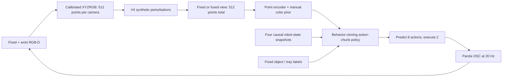

# GeoPolicy-Bench

**Reproducible robot-learning experiments: stable placement and RGB-D policy robustness in MuJoCo.**

[](https://github.com/Alecbossard/GeoPolicy-Bench/actions/workflows/checks.yml) · [MIT](LICENSE) · Windows / Python 3.11.9

Can a compact learned Panda policy place a cube reliably, and does a wrist camera help when RGB-D observations deteriorate? V3 establishes a behavior-cloning baseline; V4 studies fixed-camera versus fixed+wrist fusion under controlled synthetic perturbations. Both use **one cube, one tray and a fixed instruction**.

- **V3:** 147/150 stable placements (**98%**) on 50 reserved scenes × three training seeds. Fixed and fusion policies with the manual color prior achieve the same total.
- **V4:** without augmentation, fusion achieves **483/540 (89.4%)**, versus **272/540 (50.4%)** for fixed-only, averaged over nine synthetic perturbation settings.
- **Negative result:** the tested camera/depth augmentations show **no demonstrated overall gain**.

**V3 and V4 use different reserved tests. Their percentages are separate findings, not a direct before/after comparison.** Training uses **79 successful demonstrations from 80 collections**, plus 10 separate recorded validation demonstrations.

[V3 report](docs/v3/report.md) · [V4 report and paired intervals](docs/v4/report.md) · [Architecture](docs/architecture_v3_v4.md) · [Release and replay](docs/releases/v4.md) · [V1/V2 history](#history)

## A 5.5-second checkpoint demo


[V4 MP4](docs/media/v4_demo.mp4) · [V3 MP4](docs/media/v3_demo.mp4) · [Local V4 capture inventory and outcomes](docs/v4/videos.md)

This is the **augmented fusion policy, seed 0**, on scene 500000 with the fixed camera absent. Policy, condition and the first reserved scene were chosen before observing its outcome. The top panels show the simulator's raw RGB; the bottom panels show the actual point representations, with the fixed view empty. This single success illustrates the replay; **the 89.4% aggregate above belongs to fusion without augmentation**.

## What was measured

V3's retained recipe combines 30 post-release demonstration actions and four causal robot-state snapshots. The score requires containment, release, no finger contact and one continuous second of stability. It measures this controlled task, not general manipulation competence. [V3 raw outcomes](results/v3/all_test_rollouts.csv) · [V3 summary](results/v3/final_summary.json)

V4 compares **12 policies**: two views × augmentation on/off × three training seeds. Each gets the same demonstrations, normalization, 7D actions and **2,000 training updates**. Recipes and perturbations were selected on validation and frozen before accessing 20 new test scenes. The final evaluation contains **2,400 rollouts**: four groups × three seeds × 20 scenes × 10 conditions.

| V4 recipe | Nominal placement | Nine perturbed settings |
| --- | ---: | ---: |
| Fixed, no augmentation | 56/60 (93.3%) | 272/540 (50.4%) |
| Fixed, augmented | 54/60 (90.0%) | 271/540 (50.2%) |
| Fusion, no augmentation | 60/60 (100.0%) | 483/540 (89.4%) |
| Fusion, augmented | 58/60 (96.7%) | 470/540 (87.0%) |

Fusion minus fixed, without augmentation: **+39.07 percentage points**, paired descriptive 95% interval **[+35.00, +42.78]** over the perturbed settings. Augmentation changes those means by **−0.19 pp [−6.67, +5.56]** for fixed and **−2.41 pp [−5.74, +1.48]** for fusion. These intervals do not establish equivalence or nominal non-inferiority.

The nine settings have equal weight: fixed-camera occlusion (25/60%), fixed-camera absence, axial depth noise (3/10/25 mm) and missing points (30/70/90%). Noise and missing points affect both cameras. They act **after point sampling, before view selection**. The repeated scenes are paired; 540 rollouts are not 540 independent scenes. Intervals use a crossed scene/seed bootstrap, with three seeds and no multiplicity correction. [Frozen V4 protocol](configs/v4/final_protocol.json) · [Raw CSV](results/v4/rollouts.csv) · [Summary](results/v4/summary.json)


## How the policy works



The student predicts every command from sensor points, masks, robot state and fixed labels. Object poses and teacher phase are reserved for demonstration generation or evaluation. The manual chromatic prior is disclosed; there is no learned language grounding. [Architecture and implementation links](docs/architecture_v3_v4.md)

**QC scope:** matching concerns the **initial clean and perturbed representations of both cameras before selecting views**, together with the initial robot state and calibration. Fixed-only and fusion then select different inputs; later observations and trajectories can differ. One raw RGB component differs by one 8-bit level; its cause is unproven, the sampled initial representations match exactly, and every original outcome is retained. [QC details](docs/v4/report.md#données-protocole-et-contrats)

## Replay the compact release

The **V4 release is prepared locally and has not been published**. Its [manifest](docs/releases/v4_demo.json) records exact SHA-256 values, runtime versions and all 79 ZIP members. The source and checkpoint ZIP is **1.60 MB**; it includes normalization and expected observations/actions/physics, and needs no training HDF5 files. Video and GIF are separate assets.

After obtaining the prepared `geopolicy-v4-demo.zip`, verify it and extract it into a fresh directory. From that directory, using **Python 3.11.9**:

```powershell
python -m venv .venv
.venv\Scripts\python.exe -m pip install -r requirements-lock.txt --extra-index-url https://download.pytorch.org/whl/cu128
.venv\Scripts\python.exe scripts/v4/demo.py replay
```

Validated on Windows and an RTX 4060 Laptop 8 GB. Policy inference uses CPU; MuJoCo rendering and resource checks require the tested NVIDIA setup. The full pinned environment is larger than the bundle. Exact replay was checked from a separately extracted source copy using a second pinned environment on the same PC; cross-platform bitwise reproducibility is untested.

[Release assets, checksums and installation](docs/releases/v4.md) · [Delivery verification](docs/releases/v4_delivery_verification.json) · [Full V4 reproduction](docs/v4/reproduction.md)

## Verification and limits

- Sixteen NumPy-only V4 CPU tests cover absent cameras, masks and invalid points, axial depth noise, deterministic perturbations and restoration of the augmentation RNG. [Tests](tests/v4/test_perturbations_cpu.py)
- An independent study audit checked **3,540 rollouts and 541,220 trace steps**, including geometry, stability and perturbations. The release replay checks initial modalities, every action, the physics trace and the outcome. [Study audit](results/v4/trace_sensor_audit.json)
- This is simulation with ideal calibration, known colors/objects and a manual prior. Perturbations affect sampled points. No physical robot, real sim-to-real transfer or general fusion advantage was demonstrated.
- V3 multi-object pilots and the historical ACT-style search remained weak. Negative outcomes, raw sensor exceptions and augmentation losses stay visible in the reports.

## History

| Version | Scope and evidence |
| --- | --- |
| V4 | [RGB-D robustness and failure report](docs/v4/report.md), [validation](docs/v4/validation.md), [design](docs/v4/design.md) |
| V3 | [Imitation and stable-placement report](docs/v3/report.md), [model card](docs/v3/model_card.md), [reproduction](docs/v3/reproduction.md) |
| V2 | [Fusion/prior/ACT diagnosis](docs/v2_report.md), [reproduction](docs/v2_reproduction.md), [original README archive](docs/history/README_V2_original.txt) |
| V1 | [Original final report](docs/final_report.md), including PPO and SmolVLA extensions |

V1/V2 use different task/data/metric conditions. Their raw results and artifacts are preserved separately; they do not support subtracting historical percentages from V3/V4.

| Path | Contents |
| --- | --- |
| `src/geopolicy/v3/`, `src/geopolicy/v4/` | Current baseline, perturbations, training and evaluation |
| `configs/v3/`, `configs/v4/` | Central parameters and frozen protocols |
| `results/v3/`, `results/v4/` | Recorded outcomes, summaries and verification evidence |
| `tests/v4/`, `docs/releases/` | CPU regression checks and release provenance |
| `artifacts/` | Local checkpoints, HDF5 demonstrations and full traces; excluded from Git |

[CV bullet proposal](docs/v4/cv_bullet.md) · [Contributing](CONTRIBUTING.md) · [Third-party notices](docs/THIRD_PARTY_NOTICES.md)
