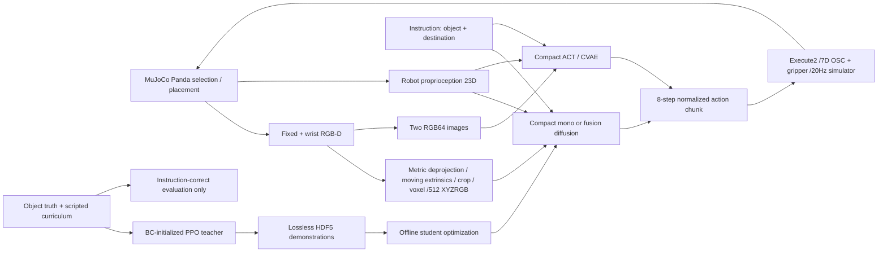

# Architecture and information boundaries

No truth pose, segmentation or curriculum-phase edge enters students. Compact language conditioning is an explicit four-dimensional semantic encoding; SmolVLA uses actual text and official preprocessing. ACT/SmolVLA have RGB and robot state, no depth. The teacher is privileged and sequences tasks through a scripted curriculum, so it is a control/data source rather than a fair visual baseline.

All students share clipped7D Cartesian/gripper commands. Learned chunks are executed directly through the validated OSC controller; no object-aware action conversion is applied. Inference computes moving wrist calibration from the robot/simulator camera pose, corresponding to a future calibrated FK transform, not target object truth. See [contracts](contracts.md) and [future physical transfer](calibration_and_transfer.md).

Training is serial with full optimizer/scheduler/normalization/RNG checkpoints. Test evaluation has independent scene seeds and persists each episode. ONNX exports only the temporal denoiser; point encoding, DDIM iteration and sensor preprocessing remain PyTorch/NumPy. Physical hardware transfer, Isaac and Jetson are outside executed results.
