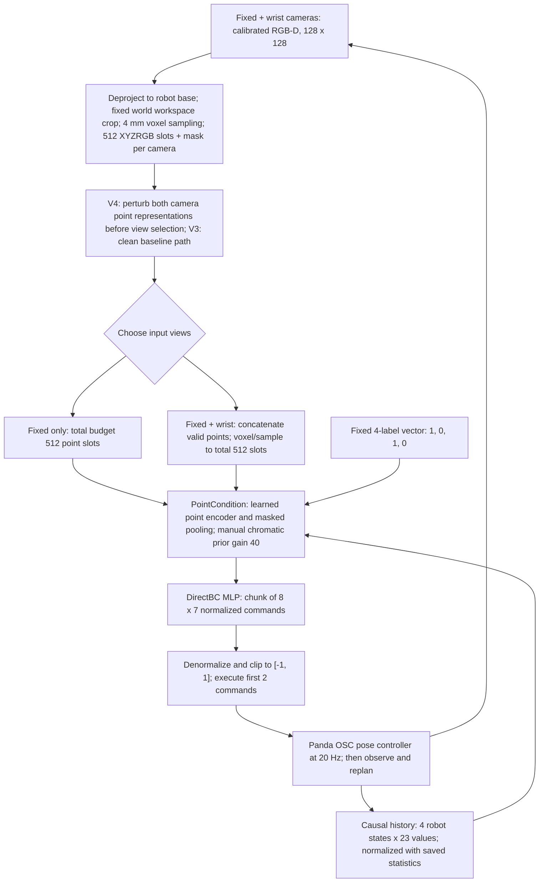

# V3/V4 architecture

V3 establishes a DirectBC baseline for placing one red cube in one blue tray.
V4 keeps its architecture, actions, normalization and training demonstrations,
and compares fixed-camera versus fixed-plus-wrist inputs, with and without
targeted augmentations. Both studies run a simulated Panda; they have not been
validated on a real robot. The simple task uses **79 training demonstrations
from 80 collections**, plus 10 recorded validation demonstrations.

The 512-point budget is shared by both views in fusion, rather than doubled.
Each point contains metric XYZ and RGB in `[0, 1]`; false masks identify padding.
The point encoder combines learned attention, maximum pooling and XYZRGB moments.
`chroma40` adds a manually designed RGB color preference with coefficient **40**
to attention logits; it is an explicit assumption, not learned language grounding.
The four instruction labels encode known object/goal classes; this task always
uses `[1, 0, 1, 0]`, not free-text instructions.

Each robot state contains joint positions/velocities, end-effector position and
quaternion, and gripper positions: 23 values, or 92 across four causal states.
The seven commands are three position deltas, three orientation deltas and one
continuous gripper command (`-1` opens, `+1` closes). All seven are predicted by
the policy. Two commands execute at 20 Hz before the next chunk is predicted.
See [sensors](../src/geopolicy/sensors.py),
[PointCondition](../src/geopolicy/policies.py),
[DirectBC](../src/geopolicy/v3/models.py),
[live inputs](../src/geopolicy/v4/data.py) and
[controller setup](../src/geopolicy/environment.py).

V4 perturbations operate **after crop/voxel/sampling**, before view selection and
fusion: fixed-camera absence or centered occlusion, axial depth noise along
calibrated rays, and missing sampled points. An absent fixed camera has an
all-false mask and zero points; the wrist representation is preserved. Invalid
points are zeroed. Raw RGB/depth are retained for provenance; corrupted XYZRGB
points and masks are the effective visual inputs. These perturbations do not
simulate raw-pixel noise, physical occluders or real sensor failures.
[Implementation](../src/geopolicy/v4/perturbations.py).

Ground-truth object/goal poses, contacts and teacher phase serve demonstration
collection or evaluation, and are excluded from student inputs. Camera
calibration is supplied by the simulator and treated as ideal. The evaluator
checks physical stability for one second after witnessed release; its ground
truth never generates or overrides a student command.
[Task](../src/geopolicy/v3/environment.py) ·
[Evaluator](../src/geopolicy/v3/metrics.py).

The V4 sensor QC compares **initial** clean and corrupted points/masks from both
cameras before view selection, plus robot state, depth and calibration. These
initial two-camera representations match exactly before view selection;
fixed-only and fusion then consume different selected point inputs. One raw RGB
component differs by one intensity level; its cause is not demonstrated and all original
rollouts are retained. This check covers initialization only: later observations
and trajectories can differ once policies choose different actions.

Recipe values and executed evidence:
[V3 plan](../configs/v3/plan.json) ·
[V4 plan](../configs/v4/plan.json) ·
[V3 report](v3/report.md) · [V4 report and QC limitations](v4/report.md).
