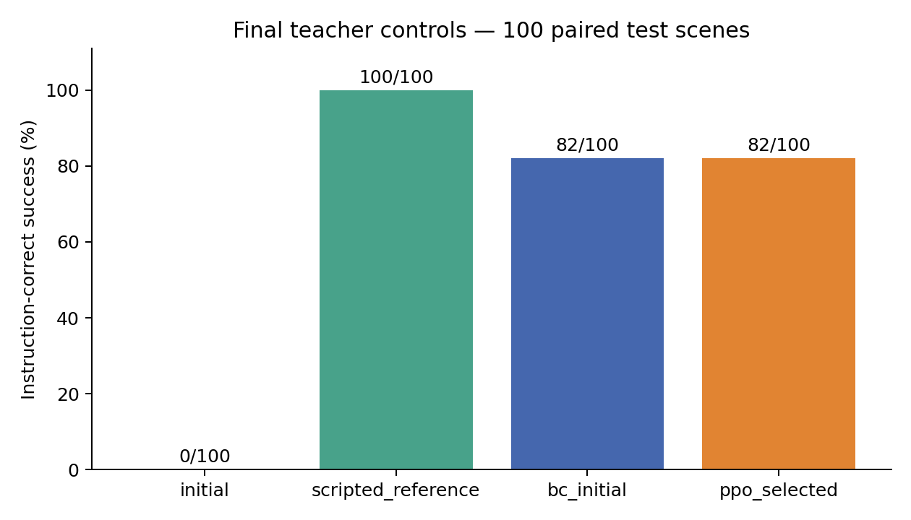
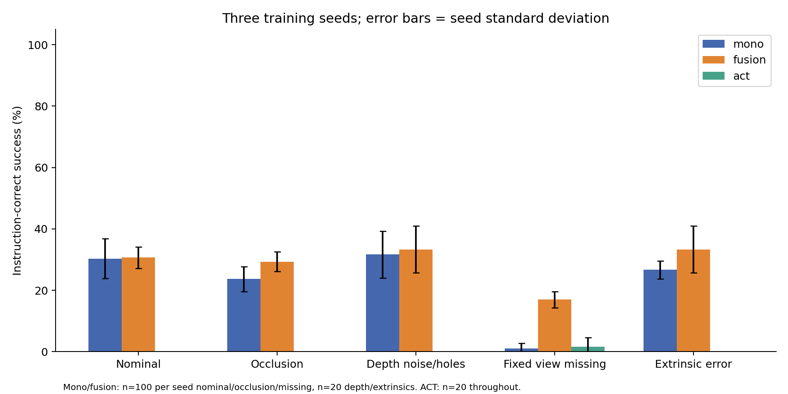
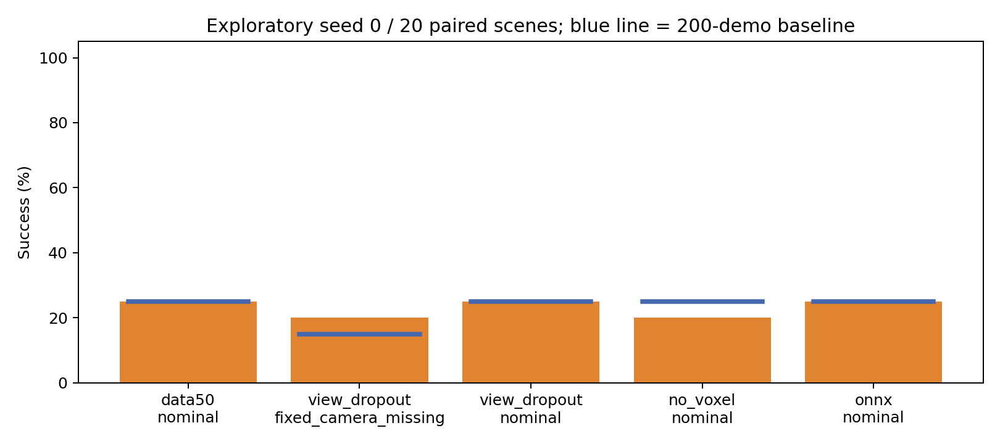
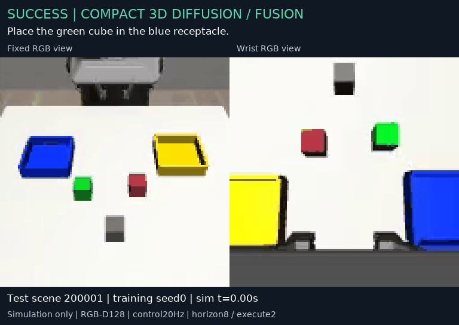
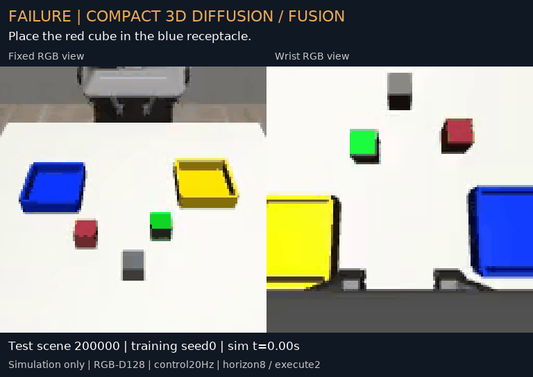

# GeoPolicy Bench — measured final report

Generated 2026-09-30T20:54:19+02:00 from completed local artifacts.

The experimental core ran on one RTX 4060 Laptop 8 GB / Ryzen 7 7435HS / 16 GB RAM Windows PC. Nine compact models were trained and evaluated in 2,340 primary closed-loop rollouts. A real pretrained SmolVLA model was additionally fine-tuned and tested. No GitHub/Hub publication or CV edit was performed.

Nominal fusion success is 30.7%, versus 30.3% for the same monocular architecture. The paired difference is +0.3 percentage points (descriptive crossed-bootstrap 95% interval [-5.0, 5.0]). The descriptive interval includes zero; these runs do not establish a consistent nominal advantage.

With the fixed camera unavailable, fusion retains 17.0% success versus 1.0% for mono: +16.0pp (descriptive 95% interval [9.0, 23.0]). This supports a narrower benefit of the additional wrist view under this camera-loss condition. Nominal, occlusion and depth results do not establish a broad fusion advantage; absolute success remains low and the extrinsic 20-scene comparison is exploratory.

## Protocol and scope

The protocol was frozen before principal training and final test. Checkpoints were selected by fixed offline validation loss, never test success. Mono/fusion share the same 200 successful demonstrations, normalization, 1,088,455-parameter architecture, 8,000 AdamW updates, batch 32, horizon 8, execute 2, 512-point budget and RGB instruction prior. Only the input views differ. Three training seeds are paired on identical test scene IDs. ACT uses the same demonstrations and update budget but different modalities and architecture. SmolVLA is exploratory and has a different budget.

| Policy | Parameters | Inputs | Train seeds / updates / batch | Pretraining |
| --- | --- | --- | --- | --- |
| Mono diffusion | 1,088,455 | Fixed XYZRGB + robot state + explicit semantic tokens | 3 / 8,000 / 32 | None |
| Fusion diffusion | 1,088,455 | Fixed + wrist XYZRGB, shared 512 points; same conditioning | 3 / 8,000 / 32 | None |
| Compact ACT adaptation | 1,051,239 | Two RGB64 + robot state + semantic tokens | 3 / 8,000 / 32 | None |
| SmolVLA | 450,046,176 total; 99,880,992 trainable | Two RGB128 resized/padded 512 + robot state + text | 1 / 500 / 1, accumulation 4 | Pinned authentic base; VLM frozen |

The custom task is Panda selection and placement with two known cube colors, two receptacle colors, positional/color-slot randomization and a distractor. Successful placement requires the instructed cube to have previously lifted, lie within 4.3 cm XY of the chosen tray, be at the accepted height and be released. This is an instantaneous condition, not a sustained stability or full-containment test. Wrong target, wrong destination, drops and contacts are separately recorded. Collision denotes robot/gripper contact penetrating table/tray-wall/distractor by over 1 mm. Students receive only RGB-D, calibration, allowed robot proprioception and instruction. Object truth, segmentation and teacher phases are excluded from student batches.

The engineered RGB chromatic attention prior only covers four known color meanings. This is an independent DP3/ACT-inspired adaptation, not an exact paper reproduction. The score is not LIBERO, arbitrary-language grounding or physical robot performance.

## PPO expert, controls and data provenance

The teacher uses a privileged scripted eight-phase waypoint curriculum. Its actor was initialized with 2,500 supervised updates on 64 clearly labeled scripted bootstrap episodes, then actually optimized with SB3 PPO for 2,048 on-policy transitions. Task sequencing remains scripted. Selected teacher demonstrations are rollouts of that PPO checkpoint, not the bootstrap script.

The exact reward, scripted phases, hyperparameters and a clearly untested reward-design hypothesis are documented in the [teacher recipe](teacher_recipe.md).

| Control | Final successful /100 | Test scenes |
| --- | --- | --- |
| initial | 0/100 | 200000–200099 |
| scripted_reference | 100/100 | 200000–200099 |
| bc_initial | 82/100 | 200000–200099 |
| ppo_selected | 82/100 | 200000–200099 |

The selected actor changed by L2=0.060520 from BC; critic/other parameters changed by 1.018540. Optimization is verified, but PPO did not improve final success over BC (both 82/100). A continuation to 34,816 total transitions regressed to 2/20 validation success and was not selected. Teacher reference counterfactuals on 10 additional test scenes ×4 instructions yielded 40/40 for the script and 34/40 for selected PPO, with identical initial geometry across instructions.

A separate, non-selected 1,024-transition CPU profiling continuation ran at 112.3 transitions/s, RSS 1.017 GiB and private committed memory 3.130 GiB. These auxiliary updates did not produce benchmark data or selected weights.

The raw collection contains 274 lossless HDF5 episodes: 250 train (208 success, 42 failure) and 24 validation (21 success, 3 failure), approximately 2.09 GB. The first 200 successful train episodes and all 21 successful validation episodes are identically selected for every student. Per-file SHA256, teacher provenance, scene seeds, images/depth/calibration, timestamps, states and actions were audited. No test scene occurs in training, including teacher training. Failures are retained but are not used for imitation optimization.

Native LeRobot export was actually reloaded: 221 episodes / 21,687 frames. RGB PNG, state/actions Parquet and actual task text are provided, with indexed HDF5 sidecars for metric depth, point clouds, extrinsics, timestamps and source hashes. Reloaded source RGB/state/actions match exactly.

## Principal closed-loop results

| Condition | Mono seed 0/1/2 | Fusion seed 0/1/2 | ACT seed 0/1/2 | n per seed mono/fusion; ACT |
| --- | --- | --- | --- | --- |
| Nominal | 24.0% / 37.0% / 30.0% | 27.0% / 34.0% / 31.0% | 0.0% / 0.0% / 0.0% | 100; 20 |
| Fixed RGB-D occlusion | 19.0% / 26.0% / 26.0% | 27.0% / 33.0% / 28.0% | 0.0% / 0.0% / 0.0% | 100; 20 |
| Depth noise / holes | 25.0% / 30.0% / 40.0% | 25.0% / 35.0% / 40.0% | 0.0% / 0.0% / 0.0% | 20; 20 |
| Fixed view missing | 0.0% / 0.0% / 3.0% | 18.0% / 19.0% / 14.0% | 0.0% / 0.0% / 5.0% | 100; 20 |
| Fixed extrinsic error | 25.0% / 30.0% / 25.0% | 25.0% / 35.0% / 40.0% | 0.0% / 0.0% / 0.0% | 20; 20 |

| Condition | Fusion mean ± seed SD | Mono mean ± seed SD | Paired fusion−mono (pp) | Crossed bootstrap 95% (pp) |
| --- | --- | --- | --- | --- |
| Nominal | 30.7 ± 3.5% | 30.3 ± 6.5% | +0.3 | [-5.0, 5.0] |
| Fixed RGB-D occlusion | 29.3 ± 3.2% | 23.7 ± 4.0% | +5.7 | [-2.0, 13.3] |
| Depth noise / holes | 33.3 ± 7.6% | 31.7 ± 7.6% | +1.7 | [-5.0, 10.0] |
| Fixed view missing | 17.0 ± 2.6% | 1.0 ± 1.7% | +16.0 | [9.0, 23.0] |
| Fixed extrinsic error | 33.3 ± 7.6% | 26.7 ± 2.9% | +6.7 | [0.0, 20.0] |

The bootstrap resamples training seeds and shared paired scene columns together (5,000 draws). Individual seed Wilson intervals and all raw metrics are in the JSON/CSV outputs. Three seeds give limited training-variability estimation; frames are not independent observations. Depth/extrinsic cells and ACT have 20 scenes per seed and remain exploratory. The OOD drop is paired with the same nominal scene subset, including first 20 rather than all 100 when appropriate. RGB-only ACT sees no change under depth-only or extrinsic-only perturbation; those conditions are input no-ops.

| Mode / condition | Paired nominal−OOD drop, seed 0/1/2 (pp) |
| --- | --- |
| mono / Fixed RGB-D occlusion | +5.0 / +11.0 / +4.0 |
| mono / Depth noise / holes | -5.0 / +5.0 / +0.0 |
| mono / Fixed view missing | +24.0 / +37.0 / +27.0 |
| mono / Fixed extrinsic error | -5.0 / +5.0 / +15.0 |
| fusion / Fixed RGB-D occlusion | +0.0 / +1.0 / +3.0 |
| fusion / Depth noise / holes | +0.0 / +0.0 / +5.0 |
| fusion / Fixed view missing | +9.0 / +15.0 / +17.0 |
| fusion / Fixed extrinsic error | +0.0 / +0.0 / +5.0 |
| act / Fixed RGB-D occlusion | +0.0 / +0.0 / +0.0 |
| act / Depth noise / holes | +0.0 / +0.0 / +0.0 |
| act / Fixed view missing | +0.0 / +0.0 / -5.0 |
| act / Fixed extrinsic error | +0.0 / +0.0 / +0.0 |

| Mode | Nominal wrong target | Wrong destination | Drop | Collision | Mean terminal XY error (cm) |
| --- | --- | --- | --- | --- | --- |
| mono | 34.7% | 0.0% | 0.3% | 11.3% | 16.72 |
| fusion | 33.0% | 0.0% | 0.3% | 14.3% | 16.32 |
| act | 11.7% | 13.3% | 0.0% | 33.3% | 23.87 |

Terminal placement errors include failed rollouts. Wrong-target flags include non-target cube lift at any point or tray proximity at the endpoint, and may coexist with eventual target success. Rates are not exclusive categories.

## Instruction counterfactuals and ablations

Each student counterfactual cell reuses 10 physical scenes with all 4 instructions. Hash equality of initial RGB, depth, allowed robot state and camera poses is asserted across instructions. Changes in first action indicate conditioning, while all-four completion is the stricter measure.

All 240 initial-observation records were identical across the four instructions, both model modes and all three training seeds within each scene; the 10 scene hashes were distinct. 0 of the 60 model/scene groups completed all four instructions. This is a substantial limitation of the learned behavior, even though each model succeeds on some individual instructions and its actions respond to the instruction.

| Mode / seed | Success /40 | Scenes with all 4 successes /10 | Object / goal first-action ΔL2 |
| --- | --- | --- | --- |
| mono / 0 | 13 | 0 | 0.063 / 0.044 |
| mono / 1 | 15 | 0 | 0.150 / 0.204 |
| mono / 2 | 15 | 0 | 0.117 / 0.305 |
| fusion / 0 | 14 | 0 | 0.115 / 0.105 |
| fusion / 1 | 17 | 0 | 0.112 / 0.098 |
| fusion / 2 | 13 | 0 | 0.128 / 0.294 |

| Variant / condition | Successful /20 | Baseline /20 | Paired difference (pp) |
| --- | --- | --- | --- |
| data50 / nominal | 5 | 5 | +0.0 |
| view_dropout / fixed_camera_missing | 4 | 3 | +5.0 |
| view_dropout / nominal | 5 | 5 | +0.0 |
| no_voxel / nominal | 4 | 5 | -5.0 |
| onnx / nominal | 5 | 5 | +0.0 |

These are one-seed, 20-paired-scene checks. The 50-demo variant uses the first 50 of the same successful demonstrations at equal 8,000-update budget; this is not a data-efficiency curve. View dropout retains one random view with 20% probability and uses a separate checkpointed RNG to preserve minibatch frame sampling. No-voxel changes inference filtering only with identical 512-point budget and fixed weights; it is not a retrained ablation. A factorial study of filtering/pretraining/architecture is outside this experiment.

## SmolVLA and negative experiments

Authentic SmolVLA received 500 optimizer updates (batch 1, accumulation 4, one seed) on the same 200 demonstrations in 637.1 s optimization-window time. The frozen pretrained VLM and official preprocessing were retained. Trainable modules are natively BF16/FP32; no additional AMP/scaler was enabled. A real forward/backward/optimizer pilot passed before fine-tuning. Pinned upstream model/tokenizer revisions and adapter provenance are retained.

Final SmolVLA nominal success: **0/20**; wrong target 0/20, collisions 5/20. Mean of per-episode policy P50/P95: 612.5 / 744.6 ms per 8-action chunk. Execution uses only 2 actions per inference; this does not establish 20 Hz real-time deployment.

SmolVLA wrong destination: 0/20; drops: 0/20; mean terminal XY error: 21.16 cm. Mean wall duration 73.10 s versus 11.00 simulated seconds per episode. The nominal test was interrupted and resumed from saved rows; wall-clock latency reflects both sessions.

| SmolVLA component | Mean episode P50 (ms) | Mean episode P95 (ms) |
| --- | --- | --- |
| preprocess | 1.47 | 1.77 |
| policy | 612.53 | 744.57 |
| total | 614.06 | 746.21 |

SmolVLA OOD was deferred because 0/20 nominal success triggered the predeclared secondary-budget gate; fine-tuning itself succeeded, and deferral is not attributed to OOM.

Retained negative pilots: epsilon-prediction diffusion 40-demo/1,000 updates yielded 0/20 validation successes despite decreasing loss; sample-prediction/legacy-prior 200-demo/2,000 updates yielded 2/20 (8/20 lifted). Final chroma40 recipe was chosen using validation before freezing the main protocol. A heuristic observation-aliasing diagnostic on 200 train episodes found zero candidates under its near-static-state/label-jump criteria. It does not demonstrate aliasing; limitations of current-frame policies and timed teacher phases remain hypotheses.

## Runtime, resources and deployment export

Policy-only profiles warm up 10 calls and time 50 batch 1 chunks, excluding rendering and preprocessing. Compact weights are FP32; native CUDA kernel dispatch may use default TF32. The main benchmark uses two-thread CPU PyTorch consistently. GPU microprofiles show small compact models can be slower on this workload; dispatch overhead is a hypothesis, not a traced conclusion.

| Policy | Device | CPU threads | Policy P50 (ms) | P95 (ms) |
| --- | --- | --- | --- | --- |
| mono | cpu | 1 | 13.52 | 14.06 |
| mono | cpu | 2 | 11.76 | 12.10 |
| mono | cuda | 1 | 29.67 | 30.28 |
| fusion | cpu | 1 | 13.44 | 14.10 |
| fusion | cpu | 2 | 12.20 | 13.72 |
| fusion | cuda | 1 | 29.70 | 30.54 |
| act | cpu | 1 | 2.22 | 2.51 |
| act | cpu | 2 | 1.55 | 2.11 |
| act | cuda | 1 | 2.22 | 2.49 |

| Mode | Mean episode preprocess P50/P95 (ms) | Policy P50/P95 (ms) | Total P50/P95 (ms) |
| --- | --- | --- | --- |
| mono | 3.36 / 4.15 | 12.80 / 13.52 | 16.18 / 17.26 |
| fusion | 6.09 / 7.08 | 12.79 / 13.60 | 18.91 / 20.14 |
| act | 0.18 / 0.28 | 2.25 / 2.74 | 2.44 / 2.95 |

Online latency values are means of episode percentiles, not pooled-call percentiles. Total is preprocessing+policy and excludes physics/control/render; it is not end-to-end wall time. Raw rollouts also record wall duration and simulated duration.

| Mode | Mean nominal wall duration (s) | Mean simulated duration (s) |
| --- | --- | --- |
| mono | 3.86 | 9.17 |
| fusion | 4.12 | 9.17 |
| act | 3.09 | 11.00 |

| Training run | Selected EMA update /8,000 | Optimization/validation/I/O seconds | Peak Torch allocated GiB |
| --- | --- | --- | --- |
| mono_s0 | 8000 | 183.2 | 0.138 |
| mono_s1 | 7500 | 229.6 | 0.138 |
| mono_s2 | 8000 | 258.0 | 0.138 |
| fusion_s0 | 8000 | 177.7 | 0.138 |
| fusion_s1 | 7500 | 201.0 | 0.138 |
| fusion_s2 | 8000 | 188.7 | 0.138 |
| act_s0 | 8000 | 234.5 | 0.131 |
| act_s1 | 8000 | 242.6 | 0.131 |
| act_s2 | 8000 | 231.7 | 0.131 |

Training manifest times exclude dataset loading/initialization. Matrix process times include those costs. Torch allocator peaks exclude other GPU processes, driver and renderer allocations.

Actual combined gates kept both RGB-D cameras alive during a trained model optimizer step with loaded AdamW moments; fresh rendering then ran while optimizer state remained allocated. Disposable copies were used and selected checkpoints were unchanged. GPU figures below are whole-device snapshots, not per-process attribution; host private memory differs from RSS.

| Gate | Batch | Torch allocated/reserved GiB | GPU used/free MiB; °C | RSS/private GiB | Probe ΔL2 |
| --- | --- | --- | --- | --- | --- |
| act | 32 | 0.120 / 0.145 | 1721, 6236, 49 | 1.781 / 4.732 | 0.000859782 |
| mono | 32 | 0.134 / 0.164 | 1761, 6196, 49 | 2.013 / 5.060 | 6.2946e-05 |
| fusion | 32 | 0.134 / 0.164 | 1761, 6196, 49 | 2.014 / 5.080 | 6.63318e-05 |
| smolvla | 1 | 1.986 / 2.119 | 3791, 4166, 49 | 4.137 / 9.809 | 0.000247562 |

ONNX opset17 exports only the FP32 temporal denoiser. Point encoding, preprocessing and the 10-step DDIM loop remain PyTorch. Maximum subgraph error is 1.07e-06; full normalized DDIM action error 4.77e-07. CPU with two threads policy-only medians are 12.18 ms PyTorch and 4.91 ms with ONNX denoiser. The separate 20-scene paired validation gives 6/20 for both, 20/20 success labels agree, 18/20 collision labels agree and terminal placement differs by up to 1.34 mm. Final paired test results appear in the ablation table. Physics equivalence is not bit-exact. TensorRT/Jetson were not executed.

A future RGB-D/action interface validates shapes, units, transforms and command limits; the calibration procedure is documented. No physical robot transfer, hardware connection or Isaac Sim/Lab run occurred.

## Demonstrations and reproduction

The success and failure videos replay the earliest successful and failed fusion seed 0 nominal test episodes respectively (200001/200000). Replay actions, steps and final placement match the source metrics exactly. Videos show actual fixed/wrist simulator frames, including the final state; magnification uses nearest-neighbor sampling.

A fresh `.venv-repro` was installed from portable pinned dependencies, passed dependency consistency checks and the CPU suite, then rendered both Lift RGB-D views and a full episode. Its selected checkpoint replay reproduced a validation success with identical first action, steps and terminal placement (zero difference). The opt-in CUDA test separately verified an exactly identical next optimizer update after restoring model/optimizer/scheduler and RNG states. An actual full-training continuation from mono seed 1 update 7,500 to 8,000 reproduced all 500 updates: raw weights, EMA, AdamW moments, scheduler, normalization, config, progress and Python/NumPy/Torch/CUDA plus minibatch RNG states are bit-identical to the original run. Only a disposable copy was optimized; selected benchmark weights were preserved. Remote GitHub CI was not executed. Full benchmark rerunning still needs the local data and model artifacts.

## Limits, artifacts and practiced skills

The benchmark tests a narrow simulated scene distribution and four instruction meanings. Calibration is known, sensor corruption is synthetic, success is instantaneous, and only three training seeds are used. Low success rates and wrong-target behavior must be read alongside any fusion advantage. BC supplies most teacher competence; no PPO improvement is claimed. SmolVLA/pretraining/ACT results cannot isolate architecture effects at equal compute. Secondary 20-scene checks do not support a broad data-efficiency or robustness claim.

Executed skills: simulated control and reward design; supervised actor initialization and on-policy PPO updates; lossless provenance-aware robot trajectory collection; dynamic RGB-D geometry/fusion; ACT/CVAE and diffusion policy training; authentic VLA fine-tuning; paired multi-seed closed-loop evaluation; resource profiling; partial ONNX export; exact checkpoint resume and clean-environment reproduction. These do not imply real-robot, Isaac or Jetson experience.

Tracked artifacts: [principal raw CSV](../results/raw/student_rollouts.csv), [per-seed CSV](../results/per_seed.csv), [principal summary](../results/benchmark_summary.json), [secondary summary](../results/secondary_summary.json), figures and lightweight demos. Full local weights/data remain ignored under `artifacts/`; see [publication instructions](artifact_publication.md). Protocol and dataset/run hashes are in `configs/` and `results/checkpoint_audit.json`.

## Proposed CV bullet — executed facts only

« Développement d’un benchmark local de robot learning sous MuJoCo/PyTorch : collecte traçable de 274 trajectoires Panda issues d’un acteur BC+PPO, entraînement ACT et diffusion 3D mono/deux vues sur 3 seeds, évaluation en 2 340 rollouts, fine-tuning SmolVLA et validation d’un export ONNX partiel sur RTX 4060 8 Go. »

This is a proposal only. The factual CV/profile files were not modified.
