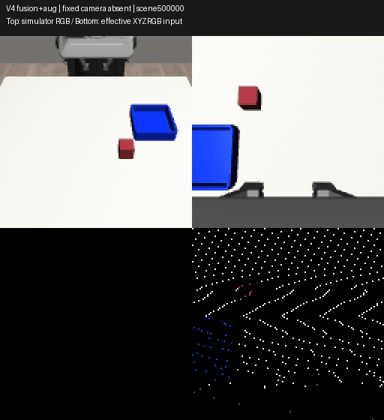

# V4 demo release — published

The **[v4-demo release](https://github.com/Alecbossard/GeoPolicy-Bench/releases/tag/v4-demo)
was published on 6 October 2026**. All nine public downloads were retrieved and
verified against SHA-256. [Download ZIP](https://github.com/Alecbossard/GeoPolicy-Bench/releases/download/v4-demo/geopolicy-v4-demo.zip) ·
[Checkpoint](https://github.com/Alecbossard/GeoPolicy-Bench/releases/download/v4-demo/checkpoint.pt) ·
[SHA256SUMS.txt](https://github.com/Alecbossard/GeoPolicy-Bench/releases/download/v4-demo/SHA256SUMS.txt).

The [machine-readable manifest](v4_demo.json) records the assets, all 79 ZIP
members, runtime versions, public URLs and SHA-256 values.
[Publication verification](v4_publication_verification.json) records the actual
release, tag commit and downloaded bytes. The original local delivery and
assets remain preserved; publication copies are in
`artifacts/releases/v4-publication-20261006/assets/`, excluded from Git.

## Results and scope

- V3: **147/150 stable placements (98%)**, one cube, one tray, fixed instruction,
  50 reserved scenes × three training seeds. Fixed and fusion with the manual
  prior have the same total. [V3 report](../v3/report.md).
- V4: fusion **without augmentation** reaches **483/540 (89.4%)**, compared with
  fixed **272/540 (50.4%)**, over nine synthetic perturbation settings. Matched
  data/actions/budgets, three seeds, 20 reserved scenes; 2,400 final rollouts.
  [V4 report and paired intervals](../v4/report.md).
- The tested augmentations show **no demonstrated overall gain**: fixed
  271/540, fusion 470/540. These negative results remain in every comparison.

V3 and V4 use different reserved tests; these scores are **not a direct
before/after comparison**. Both use 79 successful training demonstrations from
80 collections, with 10 separate recorded validation demonstrations. No real
robot or real sim-to-real transfer was evaluated.

## Demo and assets



[MP4](../media/v4_demo.mp4) · [V3 MP4](../media/v3_demo.mp4)

The demo uses **fusion with augmentation, seed 0**, absent fixed camera, scene
500000. This first reserved scene and the policy/condition were predeclared,
before observing success or failure. The top video panels show raw simulator
RGB; the bottom panels show the point inputs. The absent fixed-camera point
representation is empty. This successful replay is an illustration; **it is not
the unaugmented fusion model responsible for the 89.4% aggregate**.

| Asset | Exact size | Role |
| --- | ---: | --- |
| `geopolicy-v4-demo.zip` | 1,602,161 bytes | Self-contained source/checkpoint/expected-trace bundle |
| `checkpoint.pt` | 1,485,301 bytes | Same compact inference checkpoint as in the ZIP |
| `checkpoint_manifest.json` | 8,360 bytes | Original checkpoint, source and runtime provenance |
| `demo.mp4` | 263,029 bytes | 110-frame, 5.5-second verified video |
| `demo.gif` | 1,137,809 bytes | GitHub preview |
| `requirements-lock.txt` | 1,105 bytes | Complete environment: 61 exact package pins |
| `runtime.json` | 207 bytes | Required Python and five frozen scientific package versions |
| `release_manifest.json` | 11,969 bytes | Package manifest, member hashes and release download URLs |
| `SHA256SUMS.txt` | See local file | SHA-256 for all eight assets above |

The ZIP intentionally preserves the original bundle byte for byte. It contains
source and the compact checkpoint, expected initial modalities, actions/physics,
outcome, plans, dependency lock and license notices. It **does not contain video,
training HDF5 data or optimizer state**. Downloading the ZIP alone is sufficient
to replay and generate the video; the separately listed checkpoint/video are
convenience assets. Dependencies remain a separate installation.

ZIP SHA-256:

```text
c609fce309c21b9293cd868e90243d4c0815cf53e9a27b9f79479ce7422d9b05
```

Checkpoint SHA-256:

```text
702cc4604a593b48be1b69d9c8026e799524a24e2c7d41b4b4ee3becb14a4193
```

All nine download hashes are in the [public manifest](v4_demo.json). Use the
`SHA256SUMS.txt` release asset to check the eight downloaded asset files. Obtain
the expected manifest/hash from the repository, separately from the download.

## Reproduce the short replay

Validated setup: **Windows, Python 3.11.9, RTX 4060 Laptop 8 GB**, with
Torch 2.7.1+cu128, NumPy 1.26.4, MuJoCo 3.3.7, robosuite 1.5.2 and h5py 3.14.0.
The lock pins the full historical environment, rather than a minimal inference
environment. The existing second pinned environment passed dependency checks;
this delivery did not test a fresh network installation.

Policy inference runs on CPU with two threads. Rendering/resource checks use
the NVIDIA setup (`nvidia-smi`); this is not a GPU-free replay. The preflight
requires at least 5.5 GiB available commit memory, 1 GiB free GPU memory, 10 GiB
free disk and GPU temperature below 80 °C. Run one heavy process at a time.

From the directory containing the downloaded/prepared ZIP, PowerShell:

```powershell
$expected = 'c609fce309c21b9293cd868e90243d4c0815cf53e9a27b9f79479ce7422d9b05'
if ((Get-FileHash -Algorithm SHA256 -LiteralPath .\geopolicy-v4-demo.zip).Hash.ToLowerInvariant() -ne $expected) { throw 'Bundle SHA-256 mismatch' }
# Choose a fresh directory; keep the preserved study artifacts intact.
if (Test-Path -LiteralPath .\geopolicy-v4-replay) { throw 'Choose a new replay directory' }
Expand-Archive -LiteralPath .\geopolicy-v4-demo.zip -DestinationPath .\geopolicy-v4-replay
Set-Location .\geopolicy-v4-replay
python --version   # Must be exactly 3.11.9; the replay checks this.
python -m venv .venv
.venv\Scripts\python.exe -m pip install -r requirements-lock.txt --extra-index-url https://download.pytorch.org/whl/cu128
.venv\Scripts\python.exe scripts/v4/demo.py replay
```

No editable install of the project is necessary: the replay loads the extracted
`src/` directly. Outputs go to `artifacts/v4/demo/reproduced/` **inside that new
directory**: MP4, GIF, trace, summary and `verification.json`. Initial modalities,
every action, every recorded physics/evaluator field and the outcome must match
the expected data. Resource preflight files also remain inside the extracted
copy. Do not run export or report-generation commands over preserved outputs.

This release was extracted into a fresh directory and replayed with a second
pinned environment. A source probe confirmed that the imported `geopolicy`
module and its project root came from that extracted copy, rather than an
editable install of the original checkout. All four exact-match checks passed;
the generated MP4 SHA-256 also matched. See [delivery evidence](v4_delivery_verification.json).
This is reproduction on the same tested PC, not a bitwise guarantee on other
operating systems, drivers or hardware.

## Demo versus retraining

| Purpose | Required files | In the demo ZIP? |
| --- | --- | --- |
| Short replay | Source, V3/V4 plans, compact checkpoint with normalization, expected initial inputs/trace/row, pins and notices | Yes |
| Retrain the V4 recipes | 79 selected train HDF5 files **and 10 recorded validation HDF5 files**; selection/manifests in `configs/v3/`; original V3 normalization checkpoint; full source and central plans | Data/manifests/normalization checkpoint: no |
| Resume an interrupted training run | That run's full `latest.pt`, including optimizer and RNG states, plus the preceding retraining files | No |
| Re-evaluate the complete published study | The 12 registered V4 model checkpoints and frozen protocol, plus the full source and evaluation setup | No |
| Audit every sensor/trajectory | Preserved initial modality NPZs and full rollout traces | Only the one demo's expected data |

The 79+10 HDF5 files total **730,497,381 bytes**. The required original V3
normalization checkpoint is
`artifacts/v3/runs/bc_continued_history480_s0/best.pt` (5,962,099 bytes). Its SHA-256
is `93ddead2631290b9afd73faa777864f7824d9d671fb9b8fd0a25b2952cc03808`.
The compact demo checkpoint already embeds the normalization it needs.
The [full reproduction guide](../v4/reproduction.md) documents training/resume
commands. No training was launched for this presentation/release update.

## QC and CPU checks

The identity check concerns **initial clean and perturbed representations of
both cameras before view selection**, plus initial robot state, depth and
calibration. Fixed-only and fusion then consume different selected points;
their later observations and trajectories may differ. One raw RGB component
differs by one 8-bit level, without changing the sampled initial representations.
Its cause is unproven. No score was removed, modified or rerun to hide it.
[QC details](../v4/report.md#données-protocole-et-contrats).

Sixteen [NumPy-only CPU tests](../../tests/v4/test_perturbations_cpu.py) cover an
absent fixed camera with intact wrist data, invalid shapes/NaNs, masked-point
zeroing, all-missing and nested masks, axial noise geometry/intensity, paired
determinism and exact next augmentation after saving/restoring RNG state.
They test the perturbation contract; they do not prove physical sensor realism
or policy success. From the full repository:

```powershell
$env:PYTEST_DISABLE_PLUGIN_AUTOLOAD = '1'
.venv\Scripts\python.exe -m pytest tests/v4/test_perturbations_cpu.py -q -p no:cacheprovider
.venv\Scripts\python.exe scripts/check_publication.py
```

The publication check uses only repository files and the standard library.
Historical links to excluded local artifacts are counted as local references;
the main README and this release page use repository links. Frozen study
sources, raw outcomes, summaries and tracked videos are checked independently
of the large local datasets. Git LF/CRLF conversion is allowed for the frozen
text-file hashes in this repository-only check; the bundle/replay checks exact
original bytes.

## CV wording and publication

The [verified CV bullet proposal](../v4/cv_bullet.md) stays inside the project.
No CV file was edited. Scope and negative augmentation outcomes should accompany
the numbers; avoid implying general manipulation or real sim-to-real results.

An alternative with measured outcomes, for this project only:

> Built a reproducible MuJoCo RGB-D manipulation benchmark: 98% stable placement
> on a controlled single-cube V3 test; on a separate V4 robustness test, camera
> fusion achieved 89.4% versus 50.4% fixed-only across nine synthetic perturbations
> and three training seeds, with paired uncertainty estimates and exact checkpoint replay.

Keep the accompanying limitation: the tested augmentations showed no overall
gain, and no physical robot or real sim-to-real transfer was evaluated.

The [local delivery verification](v4_delivery_verification.json) passed on 3 October.
That record describes the original local verification;
its `prepared_locally_not_published` status is retained as historical evidence.
The [publication record](v4_publication_verification.json) now confirms all nine
public download hashes and the `v4-demo` tag at commit `753379e`.
The original checkpoint, ZIP, videos, pins and frozen scientific evidence were
not changed. Only publication metadata and documentation were updated.

V3/V4 are on `main`, and `v4-demo` provides the downloadable inference bundle.
The earlier releases and all historical checkpoints/results remain separate.
[Main README](../../README.md) ·
[V1 report](../final_report.md) · [V2 report](../v2_report.md).
