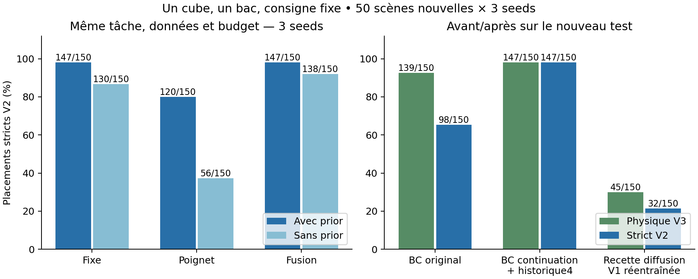

# GeoPolicy-Bench V3 — imitation et diagnostic de manipulation

**Question :** peut-on rendre une politique apprise fiable en boucle fermée,
puis mesurer ce que changent les données, l'historique et les caméras ?

**Résultat : 147/150 placements stables (98%)**
sur 50 scènes test nouvelles × 3 seeds, un cube/un bac/consigne fixe.
BC originale : 139/150 physique, 98/150 strict V2.
La recette retenue combine 30 actions post-libération et quatre états robot.
Fusion et fixe avec prior ont le même total : aucun gain de fusion face à fixe
n'est établi sur cette tâche. [Rapport avant/après et limites](report.md).



[Vidéo locale de 5,5 s environ](../../artifacts/v3/demo/replay/demo.mp4) ·
[Checkpoint compact (1.42 Mio)](../../artifacts/v3/demo/checkpoint.pt) ·
[Équivalence vérifiée](../../artifacts/v3/demo/replay/verification.json).
[Bundle ZIP local](../../artifacts/v3/demo_bundle.zip) pour conserver source,
checkpoint, trace attendue et démo vérifiée dans un même fichier.
Démo : première scène réservée 400000 / seed 0, préspécifiée ; actions intégralement
apprises, aucune pose GT ou phase teacher fournie au modèle.

## Rejouer en local

Depuis le dossier projet, environnement existant :

```powershell
.venv\Scripts\python.exe scripts/v3/replay_demo.py
```

La commande vérifie le checkpoint, les sources et la trajectoire contre le test
gelé, puis produit une vidéo. Le [guide reproductible](reproduction.md) donne
l'installation, le bundle autonome, l'entraînement et la reprise des évaluations.

## Inspecter le travail

- [Code V3](../../src/geopolicy/v3/) et [scripts de livraison](../../scripts/v3/).
- [Paramètres centraux](../../configs/v3/plan.json), [sélection sur validation](../../configs/v3/selection.json), [test gelé](../../configs/v3/final_protocol.json).
- [Résultats bruts](../../results/v3/test/), [CSV 1 500 rollouts](../../results/v3/all_test_rollouts.csv), [synthèse](../../results/v3/final_summary.json).
- [Audit des traces](../../results/v3/trace_audit.json), [livraison vérifiée](../../results/v3/delivery_verification.json), [journal](PROGRESS.md).
- [Fiche du modèle](model_card.md), [bullet CV vérifiée proposée](cv_bullet.md).

**Limites :** RGB-D idéal en simulation, objets/couleurs connus, consigne fixe,
aucune validation sur robot réel. Les pilotes à deux objets font 0/20, 0/20, 1/20 ;
la compétence multicible V3 reste à obtenir. Les références V1/V2 transférées
ont des données/budgets d'apprentissage différents. V1/V2 sont conservées,
un écart isolé d'identité des capteurs et son analyse de sensibilité sont documentés
dans le rapport ; les scores bruts sont conservés.
Le [README historique](../../README.md) reste intact. V3 n'a pas été publiée.
