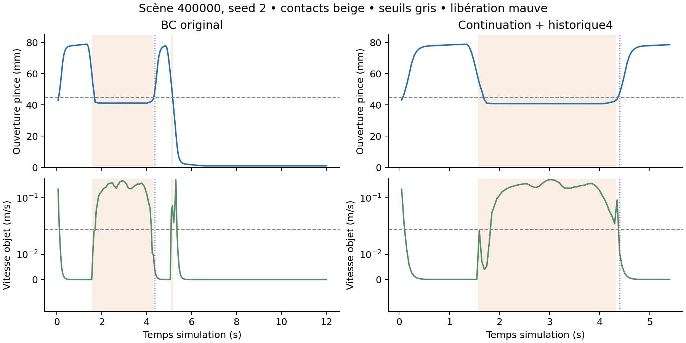

# GeoPolicy-Bench V3 — rapport avant/après, 3 octobre 2026

La baseline apprise retenue obtient **147/150 placements physiques et
147/150 placements stricts V2** sur un nouveau test : un cube, un bac,
consigne fixe. Les trois seeds rencontrent chacune les mêmes 50 scènes nouvelles.
BC originale obtient 139/150 physique et 98/150 strict.
La tâche à deux objets n'a pas franchi le seuil de compétence. V3 est livrée comme
baseline fonctionnelle sur tâche simple et étude diagnostique bornée ; aucune
réussite générale de manipulation multicible n'est revendiquée.

## Protocole et périmètre

Les étudiants reçoivent des points XYZRGB issus de RGB-D simulé, 23 valeurs d'état
robot (ou quatre états normalisés) et des labels connus d'objet/destination.
La consigne simple est fixe ; il ne s'agit pas de compréhension du langage libre.
Les poses d'objets et phases teacher sont réservées à la collecte scriptée et à
l'évaluateur. Les sept commandes de l'étudiant sont prédites, dénormalisées et
bornées à [−1,1] ; aucun script ne remplace ses actions pendant les évaluations.

80 collectes train (10000–10079), dont **79 démonstrations retenues** :
la scène 10032, échec de prise, est exclue. 10 démonstrations de validation
110000–110009 sont conservées séparément.
Tuning en boucle fermée : 110100–110119. Confirmation distincte : 110200–110219.
Chaque recette principale est répétée sur les seeds d'entraînement 0, 1 et 2.
Budget : 2 000 updates, batch 32, FP32, AdamW 3e-4→3e-5 cosine, EMA 0,995,
chunks de huit actions, exécution de deux actions à 20 Hz, horizon maximal 240 pas.
Le checkpoint de chaque run minimise le L1 des prédictions EMA sur les dix
démonstrations de validation, parmi les sauvegardes tous les 500 updates.
La **recette** est ensuite choisie par le comportement en tuning et confirmation ;
le L1 de sélection du checkpoint n'est jamais présenté comme preuve de réussite.

La continuation ajoute 30 véritables actions/observations de retrait après
libération à chaque trajectoire, plutôt que des copies d'actions. Sa normalisation
reste celle des préfixes originaux. L'historique porte uniquement sur l'état robot,
pas sur quatre images. Historique et suffixes changent respectivement la dimension
d'entrée et la distribution des exemples ; même nombre d'updates ne signifie pas
même capacité, nombre de transitions distinctes ou coût de calcul.

Le [protocole final](../../configs/v3/final_protocol.json) a été gelé à
2026-10-03T12:03:39.850847+00:00 avant l'accès aux scènes 400000–400049. Il identifie
30 checkpoints, sources, versions Python/librairies, normalisations et tenseurs EMA.
La fusion/prior/continuation/historique de quatre états avait été retenue sur confirmation ; aucun
choix de modèle, seuil ou budget n'a été changé à partir du test. Les 1 500
rollouts sont complets, sans oracle étudiant. Ce sont **50 scènes répétées sur trois seeds**, pas
150 scènes indépendantes par recette. Résultats [JSON](../../results/v3/final_summary.json),
[CSV complet](../../results/v3/all_test_rollouts.csv), [fichiers par run](../../results/v3/test/).

**Exception de qualité des capteurs :** 1 499/1 500 empreintes initiales concordent
avec la référence par scène. Poignet/prior/seed 0, scène 400014, a une empreinte
différente dans le run original. Cube/bac concordent dans les traces ; deux
replays de la séquence de 15 scènes (ce checkpoint puis fixe/seed 0) reproduisent
exactement toutes les actions et la physique des 30 rollouts. Les capteurs initiaux
de la scène 400014 sont identiques dans ces replays. L'écart original n'a pas été
reproduit et les tableaux initiaux originaux par modalité n'avaient pas été conservés ;
sa cause unique reste inconnue. [Contrôle et limites](../../results/v3/sensor_identity_quality_check.json).
Tous les scores bruts conservent les 50 scènes. Le seul contraste apparié affecté
exclut 400014 sur les trois seeds (49 scènes/seed), selon l'identité et sans utiliser
le succès pour filtrer. Avant/après et fusion/fixe restent appariés sur 50 scènes.
Cette analyse de sensibilité a été ajoutée après le contrôle final, sans retuning.

## Contrôles de cohérence exécutés

- Scène physique simple : les autres objets et le second bac sont retirés du modèle.
  Replay de 132 pas : état robot exact ; RGB, points et masques exacts à quatre
  instants (0,20,50,90). [Mesures initiales](../../results/v3/initial_checks.json).
- Normalisation/dénormalisation des actions : erreur maximale 5,96e-8.
  Dix commandes +X de 0,5 déplacent l'effecteur de +55,7 mm ; −1 ouvre la pince
  à 79,0 mm, +1 ferme à 1,93 mm dans le backend réellement utilisé.
- Batch 32, AdamW CUDA et deux renderers actifs : l'update suivant est identique
  après restauration poids/optimiseur/scheduler/EMA/RNG pour BC et diffusion.
  Les checkpoints sauvegardent aussi le RNG des batches.
- Historique enregistré/live : 102 pas, erreur d'entrée maximale nulle.
  Deux objets : 259 pas, 30 comparaisons fixe/poignet/fusion exactes.
  [Contrôles multicibles](../../results/v3/two_objects_one_goal_input_checks.json).

La géométrie exploite la calibration simulée et le repère base connu. Dans la
première observation fusionnée, seuls trois des 512 points sont fortement rouges ;
le centre d'une surface visible est biaisé par rapport au centre réel du cube.
Cela indique une couverture limitée/occlusion possible, sans établir un bug
de repère ou une cause unique des échecs. Les tests de cohérence seuls ne prouvent
pas que la représentation contient toute l'information utile à l'apprentissage.

## Avant/après contrôlé et étude caméra/prior : nouveau test

| Recette | Physique par seed /50 | Physique total | Strict par seed /50 | Strict total |
|---|---|---:|---|---:|
| Fixe, prior couleur | 49, 50, 48 | 147/150 | 49, 50, 48 | 147/150 |
| Fixe, sans prior | 49, 39, 42 | 130/150 | 49, 39, 42 | 130/150 |
| Poignet, prior couleur | 42, 39, 40 | 121/150 | 42, 39, 39 | 120/150 |
| Poignet, sans prior | 23, 18, 15 | 56/150 | 23, 18, 15 | 56/150 |
| Fusion, prior couleur — recette retenue | 49, 48, 50 | 147/150 | 49, 48, 50 | 147/150 |
| Fusion, sans prior | 47, 44, 47 | 138/150 | 47, 44, 47 | 138/150 |
| BC originale, préfixes / état courant | 49, 43, 47 | 139/150 | 40, 43, 15 | 98/150 |
| Recette diffusion V1 réentraînée, préfixes | 1, 13, 31 | 45/150 | 1, 10, 21 | 32/150 |
| Checkpoint fusion V1 préservé, transféré | 3, 2, 3 | 8/150 | 3, 2, 2 | 7/150 |
| Checkpoint fusion V2 préservé, transféré | 7, 8, 7 | 22/150 | 7, 8, 7 | 22/150 |

Les six cellules caméra/prior utilisent **les mêmes 79 démonstrations train + 10 de validation continuées,
actions, normalisations, historique de quatre états, budget et allocation totale de 512 points**.
Le prior manuel ajoute un biais chromatique aux scores d'attention ; l'ablation
le désactive et réentraîne avec le même protocole. Il n'utilise pas de pose GT.
Fusion et fixe avec prior ont le même total de succès : cette étude ne démontre
pas de gain de fusion face à la caméra fixe sur la tâche simple. Le résultat
poignet et l'effet du prior restent propres à ces scènes et capteurs simulés.
Les deux caméras sont rendues et prétraitées même dans les cellules monovue ;
les mesures ne démontrent pas une économie de capteurs/calcul en déploiement.

Intervalles descriptifs à 95 %, bootstrap apparié et croisé seed/scène,
10 000 tirages. Écart en points de pourcentage [intervalle] :

| Contraste | Scènes appariées /seed | Physique | Strict V2 |
|---|---:|---|---|
| Retenue − BC originale | 50 | +5.33 [-1.33, +14.00] | +32.67 [+7.33, +68.00] |
| Fusion − fixe, avec prior | 50 | +0.00 [-6.00, +6.00] | +0.00 [-6.00, +6.00] |
| Fusion − poignet, avec prior | 49 | +17.01 [+7.48, +27.89] | +17.69 [+8.16, +28.57] |
| Fusion sans − avec prior | 50 | -6.00 [-12.67, +0.00] | -6.00 [-12.67, +0.00] |
| BC originale − recette diffusion | 50 | +62.67 [+32.00, +94.00] | +44.00 [-8.00, +80.00] |

Avec seulement trois seeds, sans correction de multiplicité, ces intervalles
ne constituent pas une garantie de robustesse ou une attribution causale unique.
Un bootstrap proche du plafond ne capture pas les échecs encore non observés.
Le gain physique observé de5,33points a un intervalle qui contient zéro.
Le gain strict de32,67points est beaucoup plus grand : BC originale compte
41cas physique réussi/strict échoué, contre zéro pour la recette retenue.
L'amélioration stricte ne doit donc pas être confondue avec un gain de même
ampleur dans le placement physique lui-même.

## V1/V2 préservées : comparaisons et limites

Sur le **test complet historique V2 connu**, mêmes 150 épisodes et même critère
strict : fusion V1 réévaluée 16/150 contre fusion V2 10/150 ; ACT V1 réévalué
9/150 contre ACT V2 0/150. Le score instantané nominal V1 de 30,7 % n'est pas
un placement stable après libération. Voir le [rapport V2](../v2_report.md).

Le tableau du nouveau test transfère également les checkpoints fusion V1/V2
préservés dans la même scène simple, avec les mêmes capteurs et deux critères.
Leur apprentissage portait sur la tâche complète, 200 démonstrations et 8 000
updates : données, budgets, domaine d'entraînement et recettes différents de V3.
Ce transfert constitue une référence à tâche test identique, **pas une comparaison
algorithmique contrôlée ni la preuve que V3 améliore la tâche complète**.
La recette diffusion V1 réentraînée sur les préfixes simples est une autre référence,
distincte de ces checkpoints historiques.

ACT n'a pas été réentraîné en V3. Son diagnostic V2 a vérifié les voies
enregistrée/live, la normalisation (erreur 5,96e-8), le signe de pince et les
branches latent prior/posterior sans établir de bug unique. Les interventions
oracle mouvement/pince localisent une faiblesse de mouvement dans ces essais
V2 ; elles ne prouvent pas que l'architecture ACT en général est incapable.
PPO et SmolVLA restent les expériences historiques sans gain démontré.

## Facteurs isolés : validation, sans retuning sur test

| BC sur les mêmes 79 trajectoires retenues | Physique par seed /20 | Physique total | Strict total |
|---|---|---:|---:|
| Préfixes / état courant | 20, 17, 17 | 54/60 | 43/60 |
| Continuation seule | 19, 20, 11 | 50/60 | 50/60 |
| Historique de quatre états seul | 0, 0, 0 | 0/60 | 0/60 |
| Pince binaire seule | 14, 19, 9 | 42/60 | 38/60 |
| Continuation + historique de quatre états | 20, 20, 20 | 60/60 | 60/60 |

Confirmation disjointe : originale 55/60 physique et 39/60 strict ; combinaison
60/60 aux deux critères, 20/20 pour chaque seed. Les entrées initiales sont
identiques et la [règle enregistrée](../../configs/v3/interaction_confirmation_plan.json)
est franchie. La [sélection](../../configs/v3/selection.json) conserve la pince
continue. Continuation seule, historique seul et pince binaire ne démontrent
aucun gain physique régulier. La quatrième cellule données×historique est une
interaction empirique ; la cause de son gain n'est pas réduite à un seul facteur.

L'ablation pince binaire ajoute une tête de classification et une loss BCE ;
à l'inférence son signe produit −1/+1 avant normalisation. Le terme MSE de la
tête continue est conservé pendant l'entraînement. Ce traitement modifie donc
sortie/loss/capacité ; il ne sépare pas à lui seul leurs mécanismes respectifs.

La recette diffusion V1 réentraînée obtient sur tuning 2, 11, 13 succès physiques
(26/60), et 1, 10, 5 stricts (16/60). Son L1 en seed 0 est inférieur à celui de BC
malgré une moins bonne manipulation. Le surapprentissage de quatre démos simples
réussit 4/4 physique pour les deux recettes (strict : BC 0/4, diffusion 4/4) ;
sur des scènes tuning distinctes, BC 11/20 physique / 0 strict, diffusion 6/20 aux
deux critères. Mémorisation et loss ne remplacent pas l'évaluation en boucle fermée.
BC et diffusion ne sont pas égalisées en paramètres/FLOPs ; ce contraste de
recettes à budget d'updates fixé ne démontre pas une supériorité universelle de BC.

## Progression à deux objets : résultat négatif préservé

80 démos train et 10 validation à deux cubes / un bac sont toutes stables pour
la référence scriptée. Replay de 259 pas sur deux consignes, 30 comparaisons des
vues : états/historique normalisés, points, masques et tokens enregistrés/live
exacts. Les deux cubes et le bac unique sont vérifiés dans la scène.

| Pilote, seed 0, 2 000 updates | Succès /20 | Échecs dominants |
|---|---:|---|
| Continuation + historique de quatre états | 0/20 | 13 approche, 7 prise |
| Même recette, état courant | 0/20 | 10 approche, 8 prise, 2 sélection |
| Routage des moments XYZRGB vers le décodeur | 1/20 | Compétence insuffisante |

Le routage reçoit des moments extraits des mêmes points et labels connus,
sans poses GT ou phases teacher ; encodeur vérifié bit à bit avec/sans prior.
Il ne résout pas le problème et n'a pas été développé en grande matrice.
Les réponses initiales au changement de consigne sont faibles : changement moyen
de translation 0,047 / h4 et 0,076 / h1 contre 1,6 pour la référence diagnostique,
signes Y concordants dans 20/40 commandes chacun. Ce test initial ne décrit
pas toute la trajectoire et ne démontre pas une cause unique de grounding.
Un surapprentissage de quatre trajectoires à deux objets réussit 4/4 strict
sur train seulement. Le passage à deux destinations est arrêté.

**Déviation documentée :** l'étude caméra/prior est conduite sur la tâche simple
confirmée. Elle ne répond pas à la sélection multicible. Ces pilotes à une seed
et leurs échecs sont conservés ; la tâche complète V3 préparée n'a pas été exécutée.

## Stabilité, étapes d'échec et causes

Les deux critères exigent le cube entièrement dans le bac (huit sommets du cube
tourné, demi-extent 21 mm, intérieur 126 × 120 mm, marge 1 mm), centre entre 0,816 et 0,855 m,
levée antérieure >0,89 m, vitesse linéaire ≤0,02 m/s, angulaire ≤0,25 rad/s et aucun
contact doigt/pad pendant une seconde : 21 observations à 20 Hz.

Le score physique V3 exige une libération préalablement observée avec pince
ouverte ≥45 mm et cube contenu, puis une seconde de stabilité physique. La fermeture
ultérieure dans le vide n'annule pas la stabilité. Le score strict V2 exige en
plus la pince ouverte pendant tout le dwell. Le succès est mémorisé après son
premier dwell valide ; l'évaluation continue jusqu'aux deux succès ou 240 pas.
Cela n'est pas un test de stabilité indéfinie ou sous perturbation après succès.
`posture_only_failure` signifie physique réussi/strict échoué dans cette fenêtre,
sans prétendre que l'objet ne bougera jamais ensuite. Les anciens scores ne sont
pas réécrits avec le critère V3.

| Recette du test | Échecs physiques par étape | Physique réussi / strict échoué | Épisodes avec collision |
|---|---|---:|---:|
| BC originale, préfixes / état courant | grasp: 8, object_stability: 2, release: 1 | 41 | 0 |
| Fusion, prior couleur — recette retenue | release: 3 | 0 | 0 |
| Poignet, sans prior | approach: 2, grasp: 42, object_stability: 3, release: 22, transport: 25 | 0 | 34 |
| Recette diffusion V1 réentraînée, préfixes | grasp: 1, object_stability: 100, release: 3, transport: 1 | 13 | 34 |

Les étapes sont des indicateurs heuristiques de progression : approche <7 cm,
prise géométrique, levée, transport à <5 cm du bac, libération puis dwell. Elles
localisent les comportements ; elles ne constituent pas des causes exclusives.
La sélection incorrecte est suivie dans les pilotes multicibles. Sur un cube
unique, il n'existe pas de sélection entre plusieurs objets à réussir.

Cette illustration prend la première scène réservée 400000 et la même seed 2,
sans chercher une scène visuellement flatteuse ; les agrégats restent la preuve
principale. Le diagnostic de l'historique seul couvre 60 rollouts : 8 209
échantillons post-libération, 7 278 contacts et 5 578 vitesses >0,02 m/s ; aucun
épisode n'a une seconde continue d'objet calme même en ignorant les contacts.
Ses échecs ne sont donc pas seulement une fermeture de pince dans le vide.

| Établi par les essais | Hypothèse ou limite restante |
|---|---|
| Contrôles, normalisations et voies enregistrée/live concordants | Cela n'exclut pas tous les défauts de représentation ou de couverture |
| Baseline BC stable répétable sur tâche simple, sans actions oracle | Généralisation multicible, langage libre et hardware non démontrés |
| Combinaison continuation/historique utile, facteurs isolés négatifs | Couverture du retrait et interaction temporelle plausibles, mécanisme unique non démontré |
| Historique seul produit contacts et mouvements après release | Cause d'optimisation/distribution exacte non identifiée |
| Fusion et fixe avec prior ont le même total sur test | Pas de bénéfice général de fusion face à fixe établi |
| Prior influence le poignet dans cette tâche | Pas de robustesse à recoloration, profondeur bruitée ou nouveaux objets démontrée |
| Deux objets : pilotes 0, 0, 1/20 malgré cohérence des entrées | Faible réponse initiale aux labels, sans causalité unique prouvée |

## Ressources, reprise et vérification

RTX 4060 Laptop 8 Go, Ryzen 7 7435HS, RAM 16 Go. Entraînement CUDA FP32 ; évaluation
des politiques sur CPU, deux threads Torch, rendu des deux caméras sur GPU.
Un seul worker lourd à la fois. Preflight avant import Torch : commit libre ≥5,5 Gio,
VRAM libre ≥1 Gio, disque libre ≥10 Gio, GPU <80 °C. Pendant calcul : commit ≥1 Gio,
disque ≥10 Gio et GPU <80 °C, arrêt après trois relevés dangereux. Un arrêt mémoire
antérieur a conservé dix épisodes et a repris après récupération de mémoire.
Le seuil de démarrage a été documenté à partir des pics mesurés ; aucun pilote
ou paramètre système n'a été changé.

Les 506 relevés des 30 jobs de test donnent un maximum GPU
de 41 °C, usage GPU maximal 1327 Mio,
commit libre minimal 1.52 Gio et worker privé maximal
3.57 Gio. L'ensemble des jobs d'entraînement échantillonnés
atteint 47 °C maximum. Ce sont des relevés périodiques,
pas des pics continus ni une mesure énergétique.

Médiane des p95 mesurés par épisode, en millisecondes :

| Recette | Prétraitement | Prédiction CPU |
|---|---:|---:|
| Fixe, prior couleur | 6.91 | 1.54 |
| Poignet, prior couleur | 6.85 | 1.51 |
| Fusion, prior couleur — recette retenue | 6.94 | 1.57 |
| BC originale, préfixes / état courant | 7.05 | 1.64 |
| Recette diffusion V1 réentraînée, préfixes | 7.01 | 14.94 |

Ces temps excluent le rendu et le pas simulation ; les deux caméras restent
actives en monovue. Aucune performance temps réel matérielle n'est revendiquée.

L'[audit des traces](../../results/v3/trace_audit.json) reconstruit indépendamment
contenance par fonction de support, levée antérieure, bornes d'action, libération
et dwells : **2452 rollouts / 406665 pas** concordants.
Les dix tests V3 couvrent stabilité/posture, gates complets et sans oracle,
preflight, encodeur routé et identités du protocole. La démo compacte
(1.42 Mio) conserve exactement les tenseurs EMA. Sa scène préspécifiée
400000 / seed 0 reproduit exactement les capteurs, toutes les actions, la physique
et les deux scores du test gelé, dans l'environnement principal puis depuis
le bundle source/checkpoint avec l'environnement indépendant `.venv-repro`.

L'[inventaire historique](../../results/v3/preservation_check.json) vérifie les
6 210 fichiers V1/V2 par SHA256. Les données/checkpoints/traces volumineux restent
locaux sous `artifacts/v3/`, les résultats et configurations sous leurs espaces V3.
Les commandes et checkpoints de reprise sont dans [reproduction](reproduction.md).
Le [contrôle de livraison](../../results/v3/delivery_verification.json) vérifie
les 30 identités, CSV/JSON, empreintes des 180 fichiers de données et liens locaux.
La [bullet CV proposée](cv_bullet.md) utilise uniquement les essais exécutés ;
aucun fichier CV ou profil maître n'a été modifié. Cette V3 est locale, sans publication.
