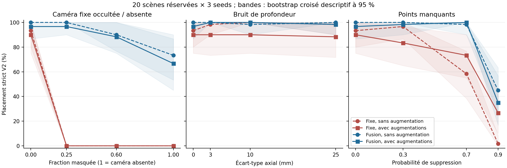

# GeoPolicy-Bench V4 — robustesse RGB-D

Cette étude compare caméra fixe et fusion fixe+poignet, chacune avec et sans
augmentations ciblées, sur un cube, un bac et une consigne fixe. Les résultats
ci-dessous sont calculés exclusivement à partir des rollouts réellement exécutés.

| Recette | Nominal physique | Nominal strict V2 | Altérations : physique | Altérations : strict V2 |
|---|---:|---:|---:|---:|
| Fixe, sans augmentation | 56/60 (93.3 %) | 56/60 (93.3 %) | 272/540 (50.4 %) | 272/540 (50.4 %) |
| Fixe, avec augmentations | 54/60 (90.0 %) | 54/60 (90.0 %) | 271/540 (50.2 %) | 271/540 (50.2 %) |
| Fusion, sans augmentation | 60/60 (100.0 %) | 60/60 (100.0 %) | 483/540 (89.4 %) | 483/540 (89.4 %) |
| Fusion, avec augmentations | 58/60 (96.7 %) | 58/60 (96.7 %) | 470/540 (87.0 %) | 470/540 (87.0 %) |

La moyenne altérée attribue le même poids à neuf réglages de perturbation.
Elle décrit ce banc synthétique ; elle ne correspond pas à la fréquence de
pannes d'un capteur réel. Les 540 rollouts par groupe répètent les mêmes
20 scènes, trois seeds et neuf conditions ; ce ne sont pas 540 scènes indépendantes.

## Avant/après contrôlé et incertitude

| Comparaison, première − seconde | Nominal physique, pp [IC95] | Altérations physique, pp [IC95] | Altérations strict V2, pp [IC95] |
|---|---:|---:|---:|
| Fixe, avec augmentations − Fixe, sans augmentation | -3.33 [-15.00, +10.00] | -0.19 [-6.67, +5.56] | -0.19 [-6.67, +5.56] |
| Fusion, avec augmentations − Fusion, sans augmentation | -3.33 [-13.33, +0.00] | -2.41 [-5.74, +1.48] | -2.41 [-5.74, +1.48] |
| Fusion, sans augmentation − Fixe, sans augmentation | +6.67 [+0.00, +20.00] | +39.07 [+35.00, +42.78] | +39.07 [+35.00, +42.78] |
| Fusion, avec augmentations − Fixe, avec augmentations | +6.67 [-1.67, +20.00] | +36.85 [+29.63, +43.89] | +36.85 [+29.63, +43.89] |

Pour fixe, les augmentations changent le taux physique nominal de -3.33 pp et la moyenne altérée de -0.19 pp. L'intervalle descriptif recouvre zéro. La conservation nominale n'est pas démontrée par un test de non-infériorité.
Pour fusion, les augmentations changent le taux physique nominal de -3.33 pp et la moyenne altérée de -2.41 pp. L'intervalle descriptif recouvre zéro. La conservation nominale n'est pas démontrée par un test de non-infériorité.

Les intervalles sont un bootstrap apparié croisé à 95 % sur trois seeds et
20 scènes, avec 10 000 tirages (RNG 81). La même scène et ses conditions restent
appariées dans chaque tirage. Pour la moyenne altérée, les neuf conditions sont
des réglages fixes : on ne les rééchantillonne pas comme des scènes indépendantes.
Trois seeds donnent une estimation fragile de la variance d'entraînement ; les
comparaisons sont descriptives, sans correction de multiplicité. Un intervalle
nul au plafond ne prouve pas l'absence d'échecs inconnus. Un intervalle qui
recouvre zéro n'établit ni équivalence de fusion/fixe, ni conservation nominale.

Les scores V3 historiques ont été mesurés sur un autre test et restent conservés.
On ne soustrait pas leurs taux à V4 pour prétendre à une amélioration appariée.

## Données, protocole et contrats

La tâche simple V3 comprend **80 collectes d'entraînement, dont 79 démonstrations
réellement utilisées**. La collecte 10032 est exclue pour échec de prise ; les
79 trajectoires continuées comprennent 9 986 observations/actions, et dix
démonstrations de validation enregistrée sont séparées. Les identités historiques
et `--limit 80` désignent une collecte ou un plafond, pas 80 succès d'entraînement.
Les quatre variantes réutilisent ce sous-ensemble, les actions et normalisations
V3 ; les budgets effectifs et distributions d'augmentations sont dans le plan.

La reprise du contrôle V3 a été vérifiée sur **120/120 traces entièrement
identiques** : checkpoints V3 diagnostiqués et contrôles V4 sans augmentation
seed 0, deux vues × six conditions × dix scènes pilotes 210000–210009.
Actions, physique et évaluateur concordent exactement dans les JSON conservés.
Ce contrôle réutilise les rollouts déjà exécutés ; il n'ajoute aucun calcul test
et n'établit l'équivalence que pour ces 120 rollouts, pas pour toutes les seeds
ou scènes. [Preuve et portée](../../results/v4/v3_clean_trace_parity.json).

Les policies prédisent les sept commandes ; le modèle reçoit uniquement XYZRGB,
masques, état robot causal et labels fixes. Poses d'objets et phase teacher servent
à la collecte ou à l'évaluateur. Aucun oracle ne remplace une action étudiante.
Le prior couleur manuel V3 est conservé : cette étude ne l'ablative pas à nouveau.

Le [protocole gelé](../../configs/v4/final_protocol.json) fixe recettes, checkpoints, perturbations et scènes. La vérification indépendante doit confirmer son horodatage antérieur au premier accès au test.
Le nouveau test est 500000–500019 : 4 groupes × 3 seeds × 10 conditions ×
20 scènes = 2 400 rollouts. Le générateur de rapport refuse toute cellule manquante
ou dupliquée et refuse des représentations initiales incompatibles. Les observations
initiales propres et perturbées des deux caméras, par modalité et avant sélection de vue, sont
conservées par l'évaluateur ; les hashes vérifiés figurent dans
[report_sensor_identity.json](../../results/v4/report_sensor_identity.json).

**Exception brute conservée :** sur 2 400 initialisations, une composante de
l'image RGB fixe varie de 133 à 134 (8 bits), scène 500017, fusion augmentée
seed 1, points manquants 70 %. La cause n'est pas démontrée. Le contrôle brut
des images reste donc négatif. Le QC après test compare les arrays **initiales** :
points XYZRGB propres/altérés et masques des **deux caméras**, état robot,
profondeur, calibration et transformations sont exactement identiques **avant
sélection des vues**. Fixe et fusion sélectionnent ensuite des entrées différentes.
Le modèle reçoit les points sélectionnés et l'état, pas l'image RGB complète.
Ce contrôle ne porte pas sur les observations ou trajectoires ultérieures,
qui peuvent diverger avec les actions. L'appariement des représentations initiales
est vérifié sans tolérance ; tous les scores originaux restent dans
les comparaisons, sans exclusion, réévaluation ni modification du protocole.
[QC des modalités et détails de l'exception](../../results/v4/initial_sensor_qc.json).

Le placement physique exige le cube entièrement dans le bac, une libération
constatée, aucun contact de doigts et une seconde de stabilité après libération,
avec les seuils V3 inchangés. Le critère strict V2 demande en plus la pince ouverte
durant ce délai. Le succès est latched ; il ne prouve pas une stabilité indéfinie.

### Plan exécuté

```json
{
  "version": 4,
  "task": "one_cube_one_tray_fixed_instruction",
  "train_collected": 80,
  "train_used": 79,
  "recorded_validation": 10,
  "excluded_train_scene": 10032,
  "training_seeds": [
    0,
    1,
    2
  ],
  "pilot_scenes": [
    210000,
    210009
  ],
  "confirmation_scenes": [
    210100,
    210109
  ],
  "reserved_test_scenes": [
    500000,
    500019
  ],
  "maximum_training_updates_total": 32000,
  "maximum_final_rollouts": 2400,
  "maximum_wall_hours": 12,
  "training": {
    "updates": 2000,
    "batch_size": 32,
    "history": 4,
    "horizon": 8,
    "execute_steps": 2,
    "learning_rate": 0.0003,
    "minimum_learning_rate": 3e-05,
    "weight_decay": 1e-05,
    "ema_decay": 0.995,
    "checkpoint_interval": 250,
    "validation_interval": 500,
    "validation_batches": 20,
    "point_budget": 512,
    "color_prior": "chroma40",
    "binary_gripper": false,
    "model": "direct_bc"
  },
  "augmentation": {
    "probabilities": [
      0.55,
      0.15,
      0.1,
      0.1,
      0.1
    ],
    "families": [
      "nominal",
      "absent",
      "occlusion",
      "depth",
      "missing"
    ],
    "occlusion_range": [
      0.2,
      0.6
    ],
    "depth_sigma_range_m": [
      0.003,
      0.02
    ],
    "missing_range": [
      0.2,
      0.7
    ]
  },
  "conditions": {
    "nominal": {
      "family": "nominal",
      "intensity": 0
    },
    "occlusion25": {
      "family": "occlusion",
      "intensity": 0.25
    },
    "occlusion60": {
      "family": "occlusion",
      "intensity": 0.6
    },
    "absent": {
      "family": "absent",
      "intensity": 1
    },
    "depth003": {
      "family": "depth",
      "intensity": 0.003
    },
    "depth010": {
      "family": "depth",
      "intensity": 0.01
    },
    "depth025": {
      "family": "depth",
      "intensity": 0.025
    },
    "missing30": {
      "family": "missing",
      "intensity": 0.3
    },
    "missing70": {
      "family": "missing",
      "intensity": 0.7
    },
    "missing90": {
      "family": "missing",
      "intensity": 0.9
    }
  },
  "pilot_conditions": [
    "nominal",
    "occlusion60",
    "absent",
    "depth010",
    "depth025",
    "missing70"
  ],
  "selection": "Pilot seed0, then disjoint validation confirmation across3seeds; choose augmentation recipe using closed-loop physical success and nominal retention. Freeze all12checkpoints and perturbations before reserved test. Best EMA per run uses clean recorded validation normalizedL1, which is not a manipulation score.",
  "representation_scope": "Perturb each calibrated 512-point camera representation before deterministic fusion: axial depth noise along camera rays; IID missing sampled points; centered image-plane occlusion of retained fixed-camera points; fixed-camera absence. This does not model raw pixel noise before voxelization nor physical sensor occluders.",
  "runtime": {
    "minimum_free_commit_before_heavy_job_gib": 5.5,
    "minimum_free_gpu_mib": 1024
  },
  "resource_limits": {
    "sample_interval_seconds": 10,
    "maximum_temperature_c": 80,
    "minimum_free_commit_mib": 1024,
    "minimum_free_disk_gib": 10,
    "consecutive_unsafe_samples": 3,
    "cell_timeout_seconds": 1800
  },
  "statistics": "Paired crossed training-seed/scene bootstrap10000draws, descriptive95%intervals, no multiplicity correction; scene repetitions are not independent fresh scenes. Aggregate robustness weights9non-nominal conditions equally. Physical primary, strict posture secondary.",
  "demo_selection_rule": {
    "group": "fusion_aug",
    "training_seed": 0,
    "condition": "absent",
    "scene_seed": 500000,
    "rule": "First reserved scene; selected before test outcomes, success or failure retained"
  }
}
```

## Pilote et validation, séparés du test

Ces observations sont de la validation connue, utilisée avant le gel. Elles sont
présentées séparément du nouveau test et ne constituent pas un second test indépendant.

| Fichier brut | Groupe | Condition | Seed(s) | Physique | Strict V2 |
|---|---|---|---|---:|---:|
| [confirmation_fixed_aug_s0_absent](../../results/v4/validation/confirmation_fixed_aug_s0_absent.json) | fixed_aug | absent | 0 | 0/10 | 0/10 |
| [confirmation_fixed_aug_s0_depth010](../../results/v4/validation/confirmation_fixed_aug_s0_depth010.json) | fixed_aug | depth010 | 0 | 10/10 | 10/10 |
| [confirmation_fixed_aug_s0_depth025](../../results/v4/validation/confirmation_fixed_aug_s0_depth025.json) | fixed_aug | depth025 | 0 | 10/10 | 10/10 |
| [confirmation_fixed_aug_s0_missing70](../../results/v4/validation/confirmation_fixed_aug_s0_missing70.json) | fixed_aug | missing70 | 0 | 10/10 | 10/10 |
| [confirmation_fixed_aug_s0_nominal](../../results/v4/validation/confirmation_fixed_aug_s0_nominal.json) | fixed_aug | nominal | 0 | 10/10 | 10/10 |
| [confirmation_fixed_aug_s0_occlusion60](../../results/v4/validation/confirmation_fixed_aug_s0_occlusion60.json) | fixed_aug | occlusion60 | 0 | 0/10 | 0/10 |
| [confirmation_fixed_aug_s1_absent](../../results/v4/validation/confirmation_fixed_aug_s1_absent.json) | fixed_aug | absent | 1 | 0/10 | 0/10 |
| [confirmation_fixed_aug_s1_depth010](../../results/v4/validation/confirmation_fixed_aug_s1_depth010.json) | fixed_aug | depth010 | 1 | 9/10 | 9/10 |
| [confirmation_fixed_aug_s1_depth025](../../results/v4/validation/confirmation_fixed_aug_s1_depth025.json) | fixed_aug | depth025 | 1 | 9/10 | 9/10 |
| [confirmation_fixed_aug_s1_missing70](../../results/v4/validation/confirmation_fixed_aug_s1_missing70.json) | fixed_aug | missing70 | 1 | 7/10 | 7/10 |
| [confirmation_fixed_aug_s1_nominal](../../results/v4/validation/confirmation_fixed_aug_s1_nominal.json) | fixed_aug | nominal | 1 | 10/10 | 10/10 |
| [confirmation_fixed_aug_s1_occlusion60](../../results/v4/validation/confirmation_fixed_aug_s1_occlusion60.json) | fixed_aug | occlusion60 | 1 | 0/10 | 0/10 |
| [confirmation_fixed_aug_s2_absent](../../results/v4/validation/confirmation_fixed_aug_s2_absent.json) | fixed_aug | absent | 2 | 0/10 | 0/10 |
| [confirmation_fixed_aug_s2_depth010](../../results/v4/validation/confirmation_fixed_aug_s2_depth010.json) | fixed_aug | depth010 | 2 | 9/10 | 9/10 |
| [confirmation_fixed_aug_s2_depth025](../../results/v4/validation/confirmation_fixed_aug_s2_depth025.json) | fixed_aug | depth025 | 2 | 9/10 | 9/10 |
| [confirmation_fixed_aug_s2_missing70](../../results/v4/validation/confirmation_fixed_aug_s2_missing70.json) | fixed_aug | missing70 | 2 | 8/10 | 8/10 |
| [confirmation_fixed_aug_s2_nominal](../../results/v4/validation/confirmation_fixed_aug_s2_nominal.json) | fixed_aug | nominal | 2 | 9/10 | 9/10 |
| [confirmation_fixed_aug_s2_occlusion60](../../results/v4/validation/confirmation_fixed_aug_s2_occlusion60.json) | fixed_aug | occlusion60 | 2 | 0/10 | 0/10 |
| [confirmation_fixed_clean_s0_absent](../../results/v4/validation/confirmation_fixed_clean_s0_absent.json) | fixed_clean | absent | 0 | 0/10 | 0/10 |
| [confirmation_fixed_clean_s0_depth010](../../results/v4/validation/confirmation_fixed_clean_s0_depth010.json) | fixed_clean | depth010 | 0 | 9/10 | 9/10 |
| [confirmation_fixed_clean_s0_depth025](../../results/v4/validation/confirmation_fixed_clean_s0_depth025.json) | fixed_clean | depth025 | 0 | 10/10 | 10/10 |
| [confirmation_fixed_clean_s0_missing70](../../results/v4/validation/confirmation_fixed_clean_s0_missing70.json) | fixed_clean | missing70 | 0 | 5/10 | 5/10 |
| [confirmation_fixed_clean_s0_nominal](../../results/v4/validation/confirmation_fixed_clean_s0_nominal.json) | fixed_clean | nominal | 0 | 9/10 | 9/10 |
| [confirmation_fixed_clean_s0_occlusion60](../../results/v4/validation/confirmation_fixed_clean_s0_occlusion60.json) | fixed_clean | occlusion60 | 0 | 0/10 | 0/10 |
| [confirmation_fixed_clean_s1_absent](../../results/v4/validation/confirmation_fixed_clean_s1_absent.json) | fixed_clean | absent | 1 | 0/10 | 0/10 |
| [confirmation_fixed_clean_s1_depth010](../../results/v4/validation/confirmation_fixed_clean_s1_depth010.json) | fixed_clean | depth010 | 1 | 10/10 | 10/10 |
| [confirmation_fixed_clean_s1_depth025](../../results/v4/validation/confirmation_fixed_clean_s1_depth025.json) | fixed_clean | depth025 | 1 | 9/10 | 9/10 |
| [confirmation_fixed_clean_s1_missing70](../../results/v4/validation/confirmation_fixed_clean_s1_missing70.json) | fixed_clean | missing70 | 1 | 5/10 | 5/10 |
| [confirmation_fixed_clean_s1_nominal](../../results/v4/validation/confirmation_fixed_clean_s1_nominal.json) | fixed_clean | nominal | 1 | 9/10 | 9/10 |
| [confirmation_fixed_clean_s1_occlusion60](../../results/v4/validation/confirmation_fixed_clean_s1_occlusion60.json) | fixed_clean | occlusion60 | 1 | 0/10 | 0/10 |
| [confirmation_fixed_clean_s2_absent](../../results/v4/validation/confirmation_fixed_clean_s2_absent.json) | fixed_clean | absent | 2 | 0/10 | 0/10 |
| [confirmation_fixed_clean_s2_depth010](../../results/v4/validation/confirmation_fixed_clean_s2_depth010.json) | fixed_clean | depth010 | 2 | 9/10 | 9/10 |
| [confirmation_fixed_clean_s2_depth025](../../results/v4/validation/confirmation_fixed_clean_s2_depth025.json) | fixed_clean | depth025 | 2 | 10/10 | 10/10 |
| [confirmation_fixed_clean_s2_missing70](../../results/v4/validation/confirmation_fixed_clean_s2_missing70.json) | fixed_clean | missing70 | 2 | 8/10 | 8/10 |
| [confirmation_fixed_clean_s2_nominal](../../results/v4/validation/confirmation_fixed_clean_s2_nominal.json) | fixed_clean | nominal | 2 | 9/10 | 9/10 |
| [confirmation_fixed_clean_s2_occlusion60](../../results/v4/validation/confirmation_fixed_clean_s2_occlusion60.json) | fixed_clean | occlusion60 | 2 | 0/10 | 0/10 |
| [confirmation_fusion_aug_s0_absent](../../results/v4/validation/confirmation_fusion_aug_s0_absent.json) | fusion_aug | absent | 0 | 7/10 | 7/10 |
| [confirmation_fusion_aug_s0_depth010](../../results/v4/validation/confirmation_fusion_aug_s0_depth010.json) | fusion_aug | depth010 | 0 | 10/10 | 10/10 |
| [confirmation_fusion_aug_s0_depth025](../../results/v4/validation/confirmation_fusion_aug_s0_depth025.json) | fusion_aug | depth025 | 0 | 10/10 | 10/10 |
| [confirmation_fusion_aug_s0_missing70](../../results/v4/validation/confirmation_fusion_aug_s0_missing70.json) | fusion_aug | missing70 | 0 | 10/10 | 10/10 |
| [confirmation_fusion_aug_s0_nominal](../../results/v4/validation/confirmation_fusion_aug_s0_nominal.json) | fusion_aug | nominal | 0 | 10/10 | 10/10 |
| [confirmation_fusion_aug_s0_occlusion60](../../results/v4/validation/confirmation_fusion_aug_s0_occlusion60.json) | fusion_aug | occlusion60 | 0 | 9/10 | 9/10 |
| [confirmation_fusion_aug_s1_absent](../../results/v4/validation/confirmation_fusion_aug_s1_absent.json) | fusion_aug | absent | 1 | 8/10 | 8/10 |
| [confirmation_fusion_aug_s1_depth010](../../results/v4/validation/confirmation_fusion_aug_s1_depth010.json) | fusion_aug | depth010 | 1 | 10/10 | 10/10 |
| [confirmation_fusion_aug_s1_depth025](../../results/v4/validation/confirmation_fusion_aug_s1_depth025.json) | fusion_aug | depth025 | 1 | 10/10 | 10/10 |
| [confirmation_fusion_aug_s1_missing70](../../results/v4/validation/confirmation_fusion_aug_s1_missing70.json) | fusion_aug | missing70 | 1 | 10/10 | 10/10 |
| [confirmation_fusion_aug_s1_nominal](../../results/v4/validation/confirmation_fusion_aug_s1_nominal.json) | fusion_aug | nominal | 1 | 10/10 | 10/10 |
| [confirmation_fusion_aug_s1_occlusion60](../../results/v4/validation/confirmation_fusion_aug_s1_occlusion60.json) | fusion_aug | occlusion60 | 1 | 9/10 | 9/10 |
| [confirmation_fusion_aug_s2_absent](../../results/v4/validation/confirmation_fusion_aug_s2_absent.json) | fusion_aug | absent | 2 | 10/10 | 10/10 |
| [confirmation_fusion_aug_s2_depth010](../../results/v4/validation/confirmation_fusion_aug_s2_depth010.json) | fusion_aug | depth010 | 2 | 10/10 | 10/10 |
| [confirmation_fusion_aug_s2_depth025](../../results/v4/validation/confirmation_fusion_aug_s2_depth025.json) | fusion_aug | depth025 | 2 | 10/10 | 10/10 |
| [confirmation_fusion_aug_s2_missing70](../../results/v4/validation/confirmation_fusion_aug_s2_missing70.json) | fusion_aug | missing70 | 2 | 10/10 | 10/10 |
| [confirmation_fusion_aug_s2_nominal](../../results/v4/validation/confirmation_fusion_aug_s2_nominal.json) | fusion_aug | nominal | 2 | 10/10 | 10/10 |
| [confirmation_fusion_aug_s2_occlusion60](../../results/v4/validation/confirmation_fusion_aug_s2_occlusion60.json) | fusion_aug | occlusion60 | 2 | 9/10 | 9/10 |
| [confirmation_fusion_clean_s0_absent](../../results/v4/validation/confirmation_fusion_clean_s0_absent.json) | fusion_clean | absent | 0 | 8/10 | 8/10 |
| [confirmation_fusion_clean_s0_depth010](../../results/v4/validation/confirmation_fusion_clean_s0_depth010.json) | fusion_clean | depth010 | 0 | 10/10 | 10/10 |
| [confirmation_fusion_clean_s0_depth025](../../results/v4/validation/confirmation_fusion_clean_s0_depth025.json) | fusion_clean | depth025 | 0 | 10/10 | 10/10 |
| [confirmation_fusion_clean_s0_missing70](../../results/v4/validation/confirmation_fusion_clean_s0_missing70.json) | fusion_clean | missing70 | 0 | 10/10 | 10/10 |
| [confirmation_fusion_clean_s0_nominal](../../results/v4/validation/confirmation_fusion_clean_s0_nominal.json) | fusion_clean | nominal | 0 | 10/10 | 10/10 |
| [confirmation_fusion_clean_s0_occlusion60](../../results/v4/validation/confirmation_fusion_clean_s0_occlusion60.json) | fusion_clean | occlusion60 | 0 | 10/10 | 10/10 |
| [confirmation_fusion_clean_s1_absent](../../results/v4/validation/confirmation_fusion_clean_s1_absent.json) | fusion_clean | absent | 1 | 8/10 | 8/10 |
| [confirmation_fusion_clean_s1_depth010](../../results/v4/validation/confirmation_fusion_clean_s1_depth010.json) | fusion_clean | depth010 | 1 | 10/10 | 10/10 |
| [confirmation_fusion_clean_s1_depth025](../../results/v4/validation/confirmation_fusion_clean_s1_depth025.json) | fusion_clean | depth025 | 1 | 10/10 | 10/10 |
| [confirmation_fusion_clean_s1_missing70](../../results/v4/validation/confirmation_fusion_clean_s1_missing70.json) | fusion_clean | missing70 | 1 | 10/10 | 10/10 |
| [confirmation_fusion_clean_s1_nominal](../../results/v4/validation/confirmation_fusion_clean_s1_nominal.json) | fusion_clean | nominal | 1 | 10/10 | 10/10 |
| [confirmation_fusion_clean_s1_occlusion60](../../results/v4/validation/confirmation_fusion_clean_s1_occlusion60.json) | fusion_clean | occlusion60 | 1 | 10/10 | 10/10 |
| [confirmation_fusion_clean_s2_absent](../../results/v4/validation/confirmation_fusion_clean_s2_absent.json) | fusion_clean | absent | 2 | 7/10 | 7/10 |
| [confirmation_fusion_clean_s2_depth010](../../results/v4/validation/confirmation_fusion_clean_s2_depth010.json) | fusion_clean | depth010 | 2 | 10/10 | 10/10 |
| [confirmation_fusion_clean_s2_depth025](../../results/v4/validation/confirmation_fusion_clean_s2_depth025.json) | fusion_clean | depth025 | 2 | 10/10 | 10/10 |
| [confirmation_fusion_clean_s2_missing70](../../results/v4/validation/confirmation_fusion_clean_s2_missing70.json) | fusion_clean | missing70 | 2 | 9/10 | 9/10 |
| [confirmation_fusion_clean_s2_nominal](../../results/v4/validation/confirmation_fusion_clean_s2_nominal.json) | fusion_clean | nominal | 2 | 10/10 | 10/10 |
| [confirmation_fusion_clean_s2_occlusion60](../../results/v4/validation/confirmation_fusion_clean_s2_occlusion60.json) | fusion_clean | occlusion60 | 2 | 8/10 | 8/10 |
| [pilot1000_fixed_aug_absent](../../results/v4/validation/pilot1000_fixed_aug_absent.json) | fixed_aug | absent | 0 | 0/5 | 0/5 |
| [pilot1000_fixed_aug_missing70](../../results/v4/validation/pilot1000_fixed_aug_missing70.json) | fixed_aug | missing70 | 0 | 1/5 | 1/5 |
| [pilot1000_fixed_aug_nominal](../../results/v4/validation/pilot1000_fixed_aug_nominal.json) | fixed_aug | nominal | 0 | 2/5 | 2/5 |
| [pilot1000_fixed_clean_absent](../../results/v4/validation/pilot1000_fixed_clean_absent.json) | fixed_clean | absent | 0 | 0/5 | 0/5 |
| [pilot1000_fixed_clean_missing70](../../results/v4/validation/pilot1000_fixed_clean_missing70.json) | fixed_clean | missing70 | 0 | 1/5 | 1/5 |
| [pilot1000_fixed_clean_nominal](../../results/v4/validation/pilot1000_fixed_clean_nominal.json) | fixed_clean | nominal | 0 | 5/5 | 5/5 |
| [pilot1000_fusion_aug_absent](../../results/v4/validation/pilot1000_fusion_aug_absent.json) | fusion_aug | absent | 0 | 3/5 | 3/5 |
| [pilot1000_fusion_aug_missing70](../../results/v4/validation/pilot1000_fusion_aug_missing70.json) | fusion_aug | missing70 | 0 | 5/5 | 5/5 |
| [pilot1000_fusion_aug_nominal](../../results/v4/validation/pilot1000_fusion_aug_nominal.json) | fusion_aug | nominal | 0 | 5/5 | 5/5 |
| [pilot1000_fusion_clean_absent](../../results/v4/validation/pilot1000_fusion_clean_absent.json) | fusion_clean | absent | 0 | 3/5 | 3/5 |
| [pilot1000_fusion_clean_missing70](../../results/v4/validation/pilot1000_fusion_clean_missing70.json) | fusion_clean | missing70 | 0 | 5/5 | 5/5 |
| [pilot1000_fusion_clean_nominal](../../results/v4/validation/pilot1000_fusion_clean_nominal.json) | fusion_clean | nominal | 0 | 5/5 | 5/5 |
| [pilot2000_fixed_aug_absent](../../results/v4/validation/pilot2000_fixed_aug_absent.json) | fixed_aug | absent | 0 | 0/10 | 0/10 |
| [pilot2000_fixed_aug_depth010](../../results/v4/validation/pilot2000_fixed_aug_depth010.json) | fixed_aug | depth010 | 0 | 9/10 | 9/10 |
| [pilot2000_fixed_aug_depth025](../../results/v4/validation/pilot2000_fixed_aug_depth025.json) | fixed_aug | depth025 | 0 | 9/10 | 9/10 |
| [pilot2000_fixed_aug_missing70](../../results/v4/validation/pilot2000_fixed_aug_missing70.json) | fixed_aug | missing70 | 0 | 6/10 | 6/10 |
| [pilot2000_fixed_aug_nominal](../../results/v4/validation/pilot2000_fixed_aug_nominal.json) | fixed_aug | nominal | 0 | 9/10 | 9/10 |
| [pilot2000_fixed_aug_occlusion60](../../results/v4/validation/pilot2000_fixed_aug_occlusion60.json) | fixed_aug | occlusion60 | 0 | 0/10 | 0/10 |
| [pilot2000_fixed_clean_absent](../../results/v4/validation/pilot2000_fixed_clean_absent.json) | fixed_clean | absent | 0 | 0/10 | 0/10 |
| [pilot2000_fixed_clean_depth010](../../results/v4/validation/pilot2000_fixed_clean_depth010.json) | fixed_clean | depth010 | 0 | 9/10 | 9/10 |
| [pilot2000_fixed_clean_depth025](../../results/v4/validation/pilot2000_fixed_clean_depth025.json) | fixed_clean | depth025 | 0 | 9/10 | 9/10 |
| [pilot2000_fixed_clean_missing70](../../results/v4/validation/pilot2000_fixed_clean_missing70.json) | fixed_clean | missing70 | 0 | 6/10 | 6/10 |
| [pilot2000_fixed_clean_nominal](../../results/v4/validation/pilot2000_fixed_clean_nominal.json) | fixed_clean | nominal | 0 | 9/10 | 9/10 |
| [pilot2000_fixed_clean_occlusion60](../../results/v4/validation/pilot2000_fixed_clean_occlusion60.json) | fixed_clean | occlusion60 | 0 | 0/10 | 0/10 |
| [pilot2000_fusion_aug_absent](../../results/v4/validation/pilot2000_fusion_aug_absent.json) | fusion_aug | absent | 0 | 7/10 | 7/10 |
| [pilot2000_fusion_aug_depth010](../../results/v4/validation/pilot2000_fusion_aug_depth010.json) | fusion_aug | depth010 | 0 | 9/10 | 9/10 |
| [pilot2000_fusion_aug_depth025](../../results/v4/validation/pilot2000_fusion_aug_depth025.json) | fusion_aug | depth025 | 0 | 9/10 | 9/10 |
| [pilot2000_fusion_aug_missing70](../../results/v4/validation/pilot2000_fusion_aug_missing70.json) | fusion_aug | missing70 | 0 | 9/10 | 9/10 |
| [pilot2000_fusion_aug_nominal](../../results/v4/validation/pilot2000_fusion_aug_nominal.json) | fusion_aug | nominal | 0 | 10/10 | 10/10 |
| [pilot2000_fusion_aug_occlusion60](../../results/v4/validation/pilot2000_fusion_aug_occlusion60.json) | fusion_aug | occlusion60 | 0 | 9/10 | 9/10 |
| [pilot2000_fusion_clean_absent](../../results/v4/validation/pilot2000_fusion_clean_absent.json) | fusion_clean | absent | 0 | 7/10 | 7/10 |
| [pilot2000_fusion_clean_depth010](../../results/v4/validation/pilot2000_fusion_clean_depth010.json) | fusion_clean | depth010 | 0 | 10/10 | 10/10 |
| [pilot2000_fusion_clean_depth025](../../results/v4/validation/pilot2000_fusion_clean_depth025.json) | fusion_clean | depth025 | 0 | 10/10 | 10/10 |
| [pilot2000_fusion_clean_missing70](../../results/v4/validation/pilot2000_fusion_clean_missing70.json) | fusion_clean | missing70 | 0 | 10/10 | 10/10 |
| [pilot2000_fusion_clean_nominal](../../results/v4/validation/pilot2000_fusion_clean_nominal.json) | fusion_clean | nominal | 0 | 10/10 | 10/10 |
| [pilot2000_fusion_clean_occlusion60](../../results/v4/validation/pilot2000_fusion_clean_occlusion60.json) | fusion_clean | occlusion60 | 0 | 10/10 | 10/10 |
| [pilot_v3_fixed_absent](../../results/v4/validation/pilot_v3_fixed_absent.json) | fixed_clean | absent | 0 | 0/10 | 0/10 |
| [pilot_v3_fixed_depth010](../../results/v4/validation/pilot_v3_fixed_depth010.json) | fixed_clean | depth010 | 0 | 9/10 | 9/10 |
| [pilot_v3_fixed_depth025](../../results/v4/validation/pilot_v3_fixed_depth025.json) | fixed_clean | depth025 | 0 | 9/10 | 9/10 |
| [pilot_v3_fixed_missing70](../../results/v4/validation/pilot_v3_fixed_missing70.json) | fixed_clean | missing70 | 0 | 6/10 | 6/10 |
| [pilot_v3_fixed_nominal](../../results/v4/validation/pilot_v3_fixed_nominal.json) | fixed_clean | nominal | 0 | 9/10 | 9/10 |
| [pilot_v3_fixed_occlusion60](../../results/v4/validation/pilot_v3_fixed_occlusion60.json) | fixed_clean | occlusion60 | 0 | 0/10 | 0/10 |
| [pilot_v3_fusion_absent](../../results/v4/validation/pilot_v3_fusion_absent.json) | fusion_clean | absent | 0 | 7/10 | 7/10 |
| [pilot_v3_fusion_depth010](../../results/v4/validation/pilot_v3_fusion_depth010.json) | fusion_clean | depth010 | 0 | 10/10 | 10/10 |
| [pilot_v3_fusion_depth025](../../results/v4/validation/pilot_v3_fusion_depth025.json) | fusion_clean | depth025 | 0 | 10/10 | 10/10 |
| [pilot_v3_fusion_missing70](../../results/v4/validation/pilot_v3_fusion_missing70.json) | fusion_clean | missing70 | 0 | 10/10 | 10/10 |
| [pilot_v3_fusion_nominal](../../results/v4/validation/pilot_v3_fusion_nominal.json) | fusion_clean | nominal | 0 | 10/10 | 10/10 |
| [pilot_v3_fusion_occlusion60](../../results/v4/validation/pilot_v3_fusion_occlusion60.json) | fusion_clean | occlusion60 | 0 | 10/10 | 10/10 |

Les observations pilotes peuvent motiver le choix d'une recette. Elles ne doivent
pas être ajoutées au dénominateur du test, et une baisse de loss n'est pas une
preuve de placement. Le journal de sélection distingue hypothèses et causes établies.

## Courbes réussite / intensité




| Condition | Fixe sans augmentation | Fixe augmentée | Fusion sans augmentation | Fusion augmentée |
|---|---:|---:|---:|---:|
| Nominal | 56/60 (93.3 %) | 54/60 (90.0 %) | 60/60 (100.0 %) | 58/60 (96.7 %) |
| Occultation fixe 25 % | 0/60 (0.0 %) | 0/60 (0.0 %) | 60/60 (100.0 %) | 58/60 (96.7 %) |
| Occultation fixe 60 % | 0/60 (0.0 %) | 0/60 (0.0 %) | 54/60 (90.0 %) | 53/60 (88.3 %) |
| Caméra fixe absente | 0/60 (0.0 %) | 0/60 (0.0 %) | 44/60 (73.3 %) | 40/60 (66.7 %) |
| Bruit profondeur σ=3 mm | 59/60 (98.3 %) | 54/60 (90.0 %) | 60/60 (100.0 %) | 60/60 (100.0 %) |
| Bruit profondeur σ=10 mm | 60/60 (100.0 %) | 54/60 (90.0 %) | 59/60 (98.3 %) | 60/60 (100.0 %) |
| Bruit profondeur σ=25 mm | 59/60 (98.3 %) | 53/60 (88.3 %) | 60/60 (100.0 %) | 59/60 (98.3 %) |
| Points manquants 30 % | 58/60 (96.7 %) | 50/60 (83.3 %) | 60/60 (100.0 %) | 59/60 (98.3 %) |
| Points manquants 70 % | 35/60 (58.3 %) | 44/60 (73.3 %) | 59/60 (98.3 %) | 60/60 (100.0 %) |
| Points manquants 90 % | 1/60 (1.7 %) | 16/60 (26.7 %) | 27/60 (45.0 %) | 21/60 (35.0 %) |

L'extrémité 100 % de la courbe d'occultation représente la caméra fixe absente.
C'est une condition distincte ; l'interpolation graphique ne prouve pas un continuum
physique de panne. Le bruit et les points manquants concernent les deux vues,
alors que l'occultation et l'absence concernent la caméra fixe.

## Diagnostics d'échec

| Recette | Condition | Étapes des échecs physiques | Physique réussi, strict échoué |
|---|---|---|---:|
| Fixe, sans augmentation | Nominal | grasp: 1; release: 3 | 0 |
| Fixe, avec augmentations | Nominal | grasp: 1; release: 3; transport: 2 | 0 |
| Fusion, sans augmentation | Nominal | aucun échec physique | 0 |
| Fusion, avec augmentations | Nominal | release: 2 | 0 |
| Fixe, sans augmentation | Occultation fixe 25 % | approach: 41; grasp: 19 | 0 |
| Fixe, avec augmentations | Occultation fixe 25 % | approach: 47; grasp: 13 | 0 |
| Fusion, sans augmentation | Occultation fixe 25 % | aucun échec physique | 0 |
| Fusion, avec augmentations | Occultation fixe 25 % | release: 1; transport: 1 | 0 |
| Fixe, sans augmentation | Occultation fixe 60 % | approach: 37; grasp: 18; transport: 5 | 0 |
| Fixe, avec augmentations | Occultation fixe 60 % | approach: 43; grasp: 17 | 0 |
| Fusion, sans augmentation | Occultation fixe 60 % | release: 3; transport: 3 | 0 |
| Fusion, avec augmentations | Occultation fixe 60 % | object_stability: 1; release: 4; transport: 2 | 0 |
| Fixe, sans augmentation | Caméra fixe absente | approach: 58; grasp: 2 | 0 |
| Fixe, avec augmentations | Caméra fixe absente | approach: 46; grasp: 14 | 0 |
| Fusion, sans augmentation | Caméra fixe absente | release: 2; transport: 14 | 0 |
| Fusion, avec augmentations | Caméra fixe absente | object_stability: 4; release: 8; transport: 8 | 0 |
| Fixe, sans augmentation | Bruit profondeur σ=3 mm | release: 1 | 0 |
| Fixe, avec augmentations | Bruit profondeur σ=3 mm | grasp: 2; release: 3; transport: 1 | 0 |
| Fusion, sans augmentation | Bruit profondeur σ=3 mm | aucun échec physique | 0 |
| Fusion, avec augmentations | Bruit profondeur σ=3 mm | aucun échec physique | 0 |
| Fixe, sans augmentation | Bruit profondeur σ=10 mm | aucun échec physique | 0 |
| Fixe, avec augmentations | Bruit profondeur σ=10 mm | release: 3; transport: 3 | 0 |
| Fusion, sans augmentation | Bruit profondeur σ=10 mm | release: 1 | 0 |
| Fusion, avec augmentations | Bruit profondeur σ=10 mm | aucun échec physique | 0 |
| Fixe, sans augmentation | Bruit profondeur σ=25 mm | release: 1 | 0 |
| Fixe, avec augmentations | Bruit profondeur σ=25 mm | release: 4; transport: 3 | 0 |
| Fusion, sans augmentation | Bruit profondeur σ=25 mm | aucun échec physique | 0 |
| Fusion, avec augmentations | Bruit profondeur σ=25 mm | release: 1 | 0 |
| Fixe, sans augmentation | Points manquants 30 % | release: 2 | 0 |
| Fixe, avec augmentations | Points manquants 30 % | grasp: 2; release: 4; transport: 4 | 0 |
| Fusion, sans augmentation | Points manquants 30 % | aucun échec physique | 0 |
| Fusion, avec augmentations | Points manquants 30 % | release: 1 | 0 |
| Fixe, sans augmentation | Points manquants 70 % | grasp: 16; object_stability: 2; release: 2; transport: 5 | 0 |
| Fixe, avec augmentations | Points manquants 70 % | grasp: 7; release: 2; transport: 7 | 0 |
| Fusion, sans augmentation | Points manquants 70 % | grasp: 1 | 0 |
| Fusion, avec augmentations | Points manquants 70 % | aucun échec physique | 0 |
| Fixe, sans augmentation | Points manquants 90 % | approach: 18; grasp: 32; transport: 9 | 0 |
| Fixe, avec augmentations | Points manquants 90 % | approach: 9; grasp: 29; release: 2; transport: 4 | 0 |
| Fusion, sans augmentation | Points manquants 90 % | grasp: 25; release: 3; transport: 5 | 0 |
| Fusion, avec augmentations | Points manquants 90 % | approach: 1; grasp: 24; release: 2; transport: 12 | 0 |

Les étapes sont des heuristiques de trace : approche, prise, transport, libération
ou stabilité. Leur fréquence ne démontre pas une cause unique. Une panne de caméra
peut déplacer toute la trajectoire ; une corrélation avec une étape de prise n'isole
pas à elle seule un défaut de perception ou de commande de pince. Les traces et
actions brutes permettent de contrôler les hypothèses sans réécrire les résultats.

## Démonstration et reproduction

[Vidéo de démonstration locale](../../artifacts/v4/demo/reproduced/demo.mp4) · [Checkpoint local](../../artifacts/v4/demo/checkpoint.pt)

[Index des huit captures préspécifiées, succès et échecs](videos.md).
Les captures de test montrent le RGB brut ; la démo principale montre aussi
l'entrée XYZRGB effective, distinction expliquée dans cet index.

[Reproduction](reproduction.md) · [CSV des rollouts](../../results/v4/rollouts.csv) ·
[Synthèse et intervalles](../../results/v4/summary.json) · [Bruts test](../../results/v4/test/).
[Vérification finale et mesures de ressources](../../results/v4/delivery_verification.json).

## Limites

Les perturbations sont synthétiques, appliquées après acquisition et échantillonnage
des points. Elles modélisent une dégradation de l'entrée de la policy et ne reproduisent
pas toutes les pannes d'un RGB-D réel : trous liés au matériau, pixels volants, biais
temporels, latence, désynchronisation, erreurs de calibration et diffusion infrarouge.
Le bruit axial ne fait pas apparaître des surfaces éliminées avant l'échantillonnage ;
la suppression de points ne correspond pas nécessairement au même pourcentage de
pixels profondeur absents. Les contrôles doivent vérifier cette distinction et les
taux effectifs, particulièrement après recadrage et fusion à budget de points constant.

Objets/couleurs et consigne sont connus ; la calibration et la dynamique restent
simulées. Aucune variation de tâche, compétence multicible, compréhension de langage
libre ou **sim-to-real réel** n'a été évalué. La comparaison n'impose aucun gain de
fusion ou d'augmentation. Les résultats négatifs sont conservés. V1/V2/V3 restent
séparées ; cette extension locale n'a pas modifié de CV ni publié de contenu en ligne.
